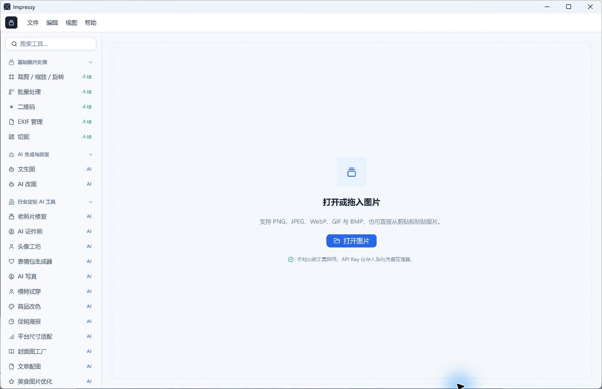
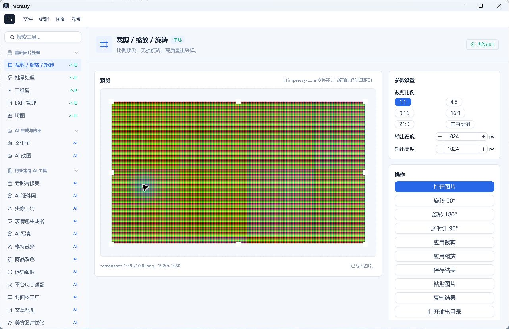
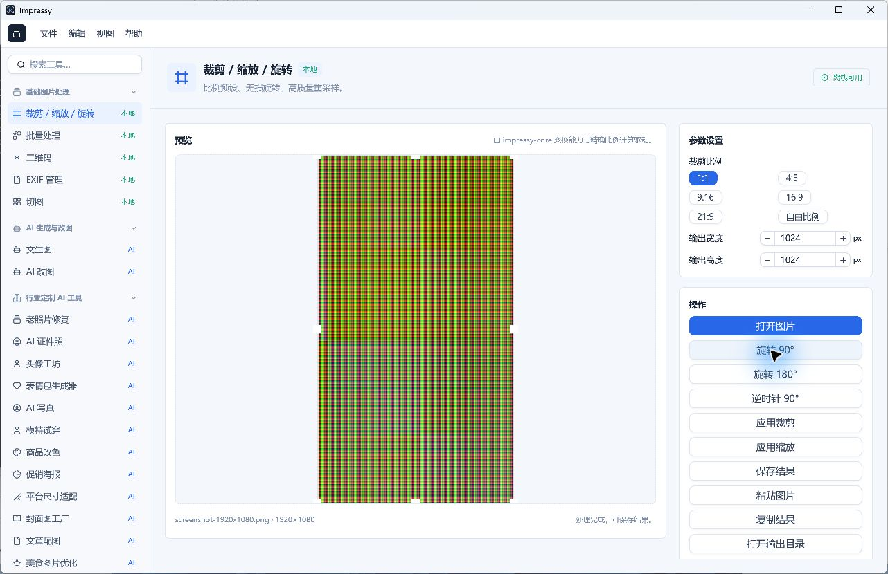
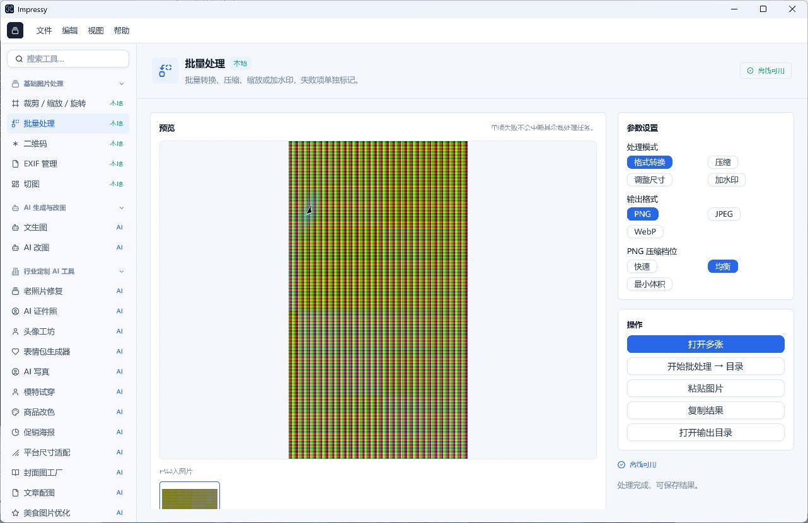
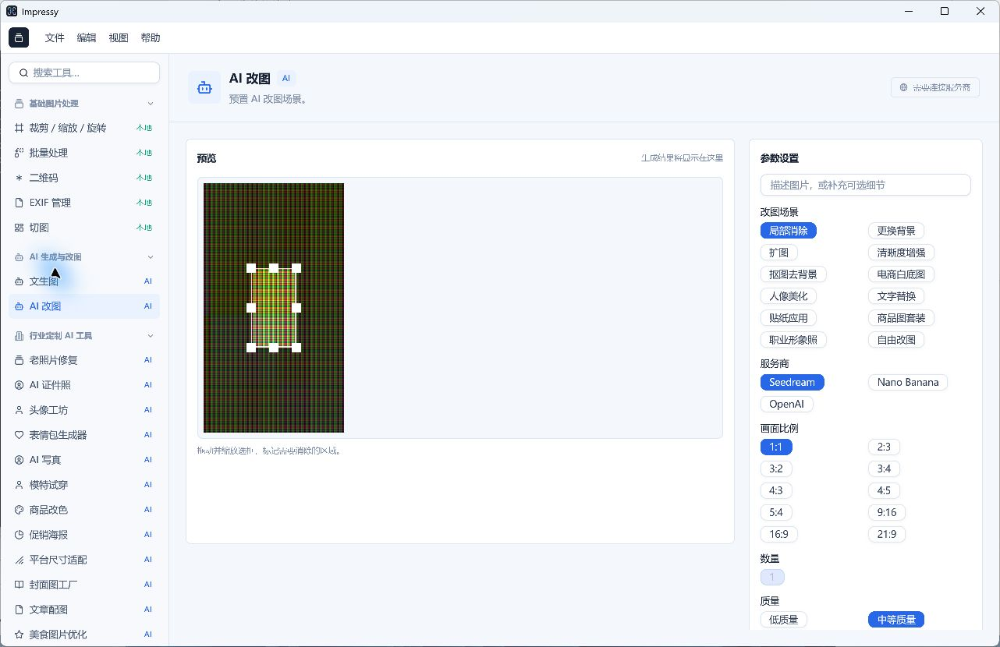
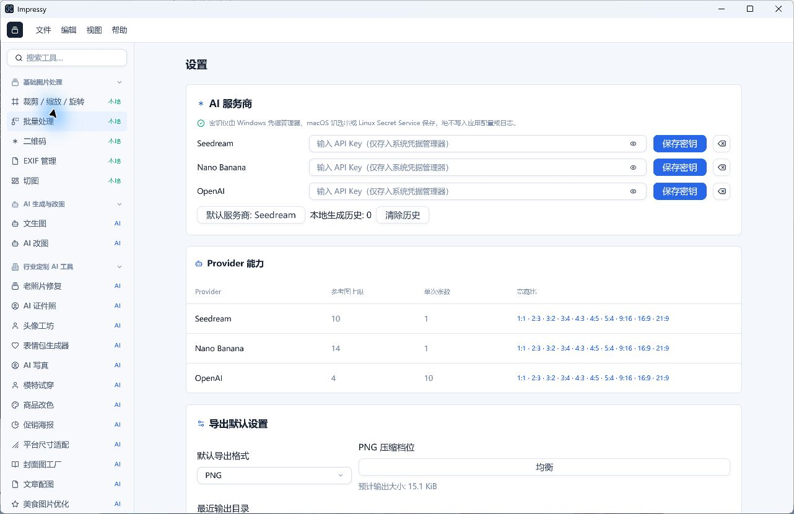

# Impressy 产品体验分析与改进建议

日期：2026-09-06。目标：让个人用户更容易完成「导入 → 连续编辑 → 检查结果 → 导出」，并让批量处理、AI 改图沿用可理解的操作规则。

## 结论

当前主要差距是编辑流程和状态语义不完整，其次才是视觉精致程度。优先修复预览与实际输入不一致、缺少撤销、输出覆盖风险；随后重组编辑器、导出和批量处理。继续增加工具入口，对核心体验的帮助小于完成这几个闭环。

值得保留的基础：本地功能与 AI 功能有文字标识；首页导入入口明确；已有原生文件选择器、工具搜索、数值输入、批处理进度和失败项模型。不能把这些已经存在的能力列为缺失。

## 证据与边界

- 源码参考：`da0e8567f28c2bff353887919f7b44be4163ad43`。检查时工作树无既有修改。
- 当前提交的 `crates/impressy-app/src/crop_frame.rs:139` 已包含合并冲突标记。`cargo build --release -p impressy-app` 失败：`encountered diff marker`。这是构建阻断项，本次没有修改它。
- 界面来自已有 `target/debug/impressy.exe`，文件时间为本机 2026-09-06 07:30；SHA-256 为 `C3D302EA6CCC330AD8389E97B7F188E50B4079D580172F4616F0AAD8DBBF832D`。不能证明它对应上述源码提交。
- 因此下文明确区分「界面实测」「源码确认」「改进建议」。不把已有 debug 二进制当作当前 SHA 的 release 验收证据。
- Windows 11 专业版，10.0.26200。系统枚举到 Intel Arc 140T、NVIDIA GeForce RTX 5060 Laptop GPU 和 GameViewer Virtual Display Adapter；未确认应用实际使用哪张 GPU。注册表 AppliedDPI=192，不能据此证明目标窗口所在显示器的有效 DPI；工具返回截图为 1282×830。
- 使用项目已有 `target/acceptance-assets/screenshot-1920x1080.png` 合成测试图，未使用用户私人照片、未调用 AI 服务、未消耗额度。
- 六张截图均在本次运行中捕获、保存并重新打开核对。没有使用历史验收截图。
- 本次是代表性流程审查和实现分析，不是全功能验收。没有完成批量导出端到端实测、AI 真实生成、GIF 播放、全部桌面尺寸、英语布局、读屏器或性能验收。
- 对标依据是产品官方文档，不是本次对竞品进行的实机可用性测试。

## 六个实际检查步骤

### 1. 首页与找工具：导入清楚，导航负担偏高

「打开或拖入图片」清楚，支持格式和本地处理提示有助于建立信任。侧栏默认展开多个长列表，行业定制 AI 工具占据大量首屏位置，创作输出在下方不可见。截图美化、拼图等日常工具的发现成本偏高。

建议保留四大板块和搜索，在首次启动时折叠较长的 AI 列表，增加用户可固定的常用工具。搜索应支持任务表达，例如「压到 200KB」「缩小图片」「拼长图」；当前是否支持这些同义词需要另行验证。无需恢复全工具卡片门户。

### 2. 导入编辑：能显示图片，操作层级和默认值有明显问题

1920×1080 图片导入后，右侧宽高仍为 1024×1024。裁剪比例高亮 1:1，但当时画布选框看起来覆盖整张横图。这是已有二进制的界面现象，需在可构建候选上重测比例同步，不能直接归因于当前源码。

打开图片仍是主色按钮，三个旋转、应用裁剪、应用缩放、保存、粘贴、复制、打开目录依次堆叠。裁剪参数和缩放参数没有明确区分；画布缺少缩放百分比、100% 检查、平移和原图对比入口。预览上方出现 `impressy-core` 等实现文案，对图片处理决策没有帮助。

### 3. 旋转并尝试撤销：操作能执行，恢复能力不足

点击旋转 90° 后图片变成竖图；按 Ctrl+Z 后仍保持旋转状态。源码菜单与快捷键注册也没有图像级 Undo/Redo。底部信息仍显示原始 1920×1080，没有区分原图尺寸和当前结果尺寸。

### 4. 切换批量处理：预览延续，处理对象语义不一致

大预览仍显示旋转后的竖图，下方输入缩略图是原始横图。源码 `prepare_batch_paths` 使用原始输入集合，不能保证处理的就是大预览中的结果。界面提供格式转换、压缩、调整尺寸、加水印四种互斥模式；不是一条可以组合的处理流程。

批量页保留了前一操作的「处理完成，可保存结果」文案，容易被误认为批量处理已经完成。下方输入图条也被推到首屏边缘。

### 5. 切换 AI 改图：参数过长，参考图与请求存在错位风险

场景、服务商、十个比例、数量、质量全部展开；生成按钮不在本次首屏内。参考图只占画布一小块，局部消除却需要精确选区。界面参考图沿用旋转后的预览，而源码请求使用最初导入的图片集合。这不仅影响预览可信度，也可能让局部消除的选区作用于错误方向的源图。

本次未点击生成，未验证真实服务商的响应和保持不变项。

### 6. 设置与导出参数：选项存在，但任务顺序被打断

设置首屏先展示三家 AI 服务商和 Provider 能力表，随后才是导出默认设置。格式和预计体积已经实现；问题在于单次导出时这些选项离图片太远。改变某一张图片的输出格式，不应要求用户离开编辑器修改全局偏好。

## 按优先级排列的问题

优先级含义：P0 为数据/处理对象正确性；P1 为核心任务明显受阻；P2 为效率、易发现性和精细体验。这里的排序是产品判断，不是用户研究统计结果。

### UX-01 / P0：统一「原图、当前结果、预览、处理输入」

证据：步骤 3–5；`workspace.rs:317,348,455,525,668,688`，`shell.rs:3206,3559`。

编辑中的裁剪/旋转/缩放采用当前结果；截图美化特意采用原图；切图与批处理采用输入集合；AI 预览读取 workspace.preview，而请求读取 ai_reference_images。这些路径各自有实现理由，但 UI 没有向用户说明差异。

改进：建立同一份当前文档状态；预览和执行消费同一个版本。截图美化重复调参应以「进入该工具时的当前结果」为基底，避免效果叠加，同时保留之前的裁剪。AI 接收前提供明确的「使用当前编辑结果」；批量处理如果针对独立输入集合，应展示该集合的预览，不沿用单图编辑结果。局部编辑选区必须绑定相同版本、方向和尺寸的参考图。

验收：导入非对称横图 → 旋转 → 裁剪 → 美化 → 切图/AI 参考图；每一步显示、处理和导出对应同一版本。用请求 mock 检查实际编码图片和选区映射，无需真实额度。

### UX-02 / P0：批处理和切图输出不能静默覆盖旧结果

证据：源码 `workspace.rs:927,989` 直接 `std::fs::write`；`impressy-core/src/naming.rs:35,45` 使用确定性文件名。这是源码确认的重复任务覆盖风险，未通过覆盖用户文件进行实测。

改进：默认生成不冲突文件名或每次任务独立子目录；冲突时允许「保留两份 / 跳过 / 替换」，只在实际存在冲突时询问。先写临时文件再完成替换，减少中断时破坏输出的风险。

验收：同目录连续导出两次不会默认破坏第一次输出；同名异内容文件、只读文件和写入失败均有可理解的结果。

### UX-03 / P1：增加撤销、重做、重置和未保存状态

证据：步骤 3；`menus.rs:13,107,149` 没有图像级撤销；`shell.rs:1467` 菜单退出直接 quit；workspace 只有当前结果，没有图像编辑历史。

改进：工具栏和菜单提供撤销/重做，支持平台惯用快捷键；「重置当前工具」与「恢复原图」区分；关闭/替换存在未保存结果的文档时提供保存、放弃、取消。历史采用操作记录与有限缓存，避免每一步都无上限复制 50MP 图像。

验收：旋转、裁剪、缩放连续执行后逐步撤销/重做；新开图、退出、导出后未保存标记符合实际状态。输入框内的文本撤销不误触图像撤销。

### UX-04 / P1：拆清裁剪与缩放，默认保留宽高比

证据：步骤 2；`feature_params.rs:155,408,412` 默认 1024×1024，宽高独立修改；`shell.rs:1857` 裁剪与输出尺寸并列；变换层接受目标宽高直接重采样。

改进：用「裁剪 / 调整尺寸 / 旋转」明确工具状态；初始尺寸来自当前图；锁定比例默认开启；支持百分比、最长边、不放大小图。用户主动解锁后才允许拉伸。裁剪框、比例高亮、显示的像素尺寸必须同步。

验收：1920×1080 设置宽 960 时，高自动变为 540；锁比开关作用清楚；裁剪 1:1 实际导出确为正方形；重开另一张图后不误用上一张尺寸。

### UX-05 / P1：让图片成为工作区主体，主操作始终可见

证据：步骤 2、5；`shell.rs:2300,2526,2795,3984`。

改进：顶部固定「文件名、撤销、重做、对比、导出」；导入后「打开图片」降为次要动作。旋转用紧凑按钮，不占三行。右侧只展示当前工具参数，底部固定「应用」或「生成」。画布保持在视野内，参数独立滚动。加入适应窗口、100%、缩放、平移与透明棋盘背景。

验收：在 1280×800 和 1366×768 对应的可用逻辑空间中，导出/生成无需滚动找按钮；长参数面板不把画布一起卷走；窄窗口不截断关键内容。实际物理分辨率和 DPI 要分别记录。

### UX-06 / P1：把单次导出选项放回导出流程

证据：步骤 6；`shell.rs:1171,4163,4324`；`workspace.rs:822` 保存编码设置在选择路径前确定。

改进：点击导出打开轻量面板，集中显示格式、尺寸、JPEG/WebP 质量或 PNG 压缩级别、预计体积、透明度处理、文件名和目录。设置页只保存默认值。默认另存副本；扩展名、实际编码与格式选择保持一致。现有后台体积估算可复用。

验收：编辑完成后无需进入设置即可另存 JPEG/WebP；更改质量后体积估算更新；PNG 不误导为有损画质滑块；透明图导出 JPEG 时能看见背景处理结果。追加「目标体积」属于下一阶段增强，不必阻塞第一版导出闭环。

### UX-07 / P1：批处理需要组合动作和任务结果列表

证据：步骤 4；`shell.rs:1670` 的 BatchMode 只生成一个 BatchRequest；`workspace.rs:952` 已有逐项进度和失败项，不应重复建设成只有一个总百分比。

改进：组织为「输入图片 → 处理步骤 → 输出」。允许一次完成缩小、加水印、转 JPEG；预览选中图片应用整条流程的结果。输入区支持追加；当前加载路径替换整个输入集合，应区分追加和重新选择。结果表展示文件名、原/新尺寸与体积、成功/失败原因，并允许只重试失败项。新增取消剩余任务，在文件边界停止，不破坏已完成项。

验收：用 100 张图和混合失败样本完成组合处理；取消后已完成文件可用；仅重试失败项不覆盖成功输出。常用组合可保存为用户预设。

### UX-08 / P2：导航优先表达用户任务

证据：步骤 1；`shell.rs:4519` 附近 navigation_groups 把拼图、截图美化放入创作输出，而 section_for_feature 将它们归为基础图片处理。

改进：先保留现有四大板块，统一功能归属映射，默认折叠较长列表；添加最近/固定工具，搜索任务同义词；三个视频占位保持「开发中」并降低视觉权重。若未来改变板块结构，需同步 spec 和领域词汇，而不是在 UI 内新增另一套分类。

验收：无需滚动长 AI 列表也能快速找到拼图和截图美化；侧栏、菜单「转到」、搜索结果的归属和选中状态一致。

### UX-09 / P1：AI 操作应围绕任务引导，降低参数负担

证据：步骤 5、6；`shell.rs:860` 每次进入 AI 功能会重置比例/档位选择；`shell.rs:3984` 附近主操作在参数列表末端。

改进：优先展示「参考图 → 场景/档位 → 生成」；服务商、质量、数量放入可折叠高级设置，保留当前配置摘要。未配置时在本页提供清楚的服务商设置入口；明确图片会发送到选定服务商，避免本地处理文案被误解为 AI 也不上传。每个工具保留最近选择。局部消除需放大参考图、提供清晰遮罩和重置选区；结果支持原图对比和继续本地编辑。

验收：返回某个 AI 工具不丢失尚未提交的设置；适用工具默认保留源图比例；看得到主按钮；无密钥、能力不支持、网络失败均能就地恢复。行业工具需逐项展示保持不变项，并继续进行人工视觉验收，不能用参数齐全代替生成质量合格。

### UX-10 / P2：信息与反馈必须对应当前任务

证据：步骤 3、4 底部保留源图尺寸/前一任务状态；步骤 2 出现实现说明；步骤 6 使用 Provider 中英混杂标签。

改进：分别标出原图/当前结果尺寸、格式与体积；状态关联当前文档与任务，切换工具后不出现歧义。错误显示可执行下一步；技术细节放可展开诊断。删除面向普通用户的 crate、后台架构说明；已有本地/AI 标签保留，重复多处的同义状态提示合并。

验收：旋转后当前尺寸显示交换；批量页不会把单图编辑成功当作批量成功；所有中英文键同步；错误状态不仅依赖颜色。

### UX-11 / P1：GIF 生成后需要真实播放预览

证据：源码 `workspace.rs:943` GIF 结果的 preview 是第一张输入图，转换为静态 RenderImage。此处属于源码分析，本次未实机操作 GIF 页面。

改进：提供播放/暂停、帧序号、总时长、帧间隔和排序预览；每次改播放方向/帧延迟都能检查实际效果。

验收：正序、倒序、往返在预览与导出 GIF 中一致，改变帧间隔可观察到速度变化；保存前无需借助其他软件检查动画。

### UX-12 / P1：补齐键盘和辅助技术路径

证据：步骤 1 的 Windows UI Automation 树只返回窗口、系统菜单和最小化/最大化/关闭，没有业务按钮；原生文件选择器则返回完整树。工具观察存在局限，不能直接断言所有读屏器不可用。

改进：验证 GPUI 对当前平台的语义与焦点支持，为核心控件提供名称、角色、选中/禁用状态；建立可见 Tab 焦点、合理焦点顺序、Esc 退出当前工具、键盘可调选区。小号浅色辅助文字需要做对比度和高 DPI 测试。

验收：仅用键盘完成导入、调整尺寸、导出；使用 Windows Narrator/NVDA 检查业务控件。其他平台单独验收；本报告不声明符合任何完整无障碍标准。

## 竞品中值得借鉴的交互

| 参考产品 | 官方资料确认的模式 | 对 Impressy 的启发 |
| --- | --- | --- |
| Paint.NET | 当前会话的操作历史、撤销/重做、选择历史节点回退 | 优先补齐可恢复编辑，而不是继续增加入口 |
| XnConvert / XnView MP 批量处理 | Input → Action → Output → Status；组合处理步骤；锁比和最长边；保存整套设置为预设 | 批量流程按用户工作顺序组织，一次完成多种操作 |
| Photoshop Export As | 格式、质量、锁定宽高比、文件大小、输出位置等集中配置 | 把导出做成可检查结果的一步，保留简洁默认值 |
| Microsoft Photos | 围绕当前照片进入编辑、裁剪旋转等操作 | 以图片为中心组织高频工具，降低模式切换成本 |

来源（2026-09-06 查阅）：

- [Paint.NET History Window](https://paint.net/doc/latest/HistoryWindow.html)
- [XnView / XnConvert 批量处理官方指南](https://www.xnview.com/en/how-to-batch-convert-and-batch-process/)
- [Photoshop 导出设置官方文档](https://helpx.adobe.com/uk/photoshop/desktop/save-and-export/export-files-to-different-formats/export-settings-and-export-location-preferences.html)
- [Microsoft Photos 编辑官方说明](https://support.microsoft.com/en-us/windows/apps/photos/edit-photos-and-videos-in-windows)

建议吸收上述交互规则，保持 Impressy 的轻量原生定位。完整图层体系、RAW 工作流、素材社区、屏幕截图恢复等需要独立产品决策，本轮不作为必做项。尤其屏幕截图/取色已按 ADR-0003 排除，不能把它们记作当前缺陷。

## 建议的改版目标

单图编辑：打开图片 → 当前文档画布 → 选择工具 → 实时检查/应用 → 可撤销地继续编辑 → 导出面板 → 保存副本。

布局建议：顶部固定文档状态和导出；左侧四大板块可折叠，常用工具可固定；中间画布占主要面积；右侧仅展示当前工具；底部显示尺寸、缩放与任务状态。先用现有 GPUI 组件完成结构调整，不必重做整套视觉系统。

批量处理：先管理输入，再排列处理步骤，再设置输出；画布始终预览被选中输入经过全部步骤的结果。

AI 功能：明确选择当前结果/参考图，设置场景或档位，生成，检查保持不变项，挑选结果继续编辑或导出。服务商设置仍是可选 AI 能力，本地功能不依赖其初始化。

## 推进顺序与验收场景

1. **先建立可靠候选**：修复当前提交的冲突标记，恢复 check/clippy/test/release 构建；记录精确 SHA。该工作不包含在本次分析中。
2. **第一批：正确性和恢复**：UX-01、02、03、04；同时为预览/处理输入、连续变换、输出冲突写有价值的状态与契约测试。
3. **第二批：单图闭环**：UX-05、06、10；以「横图裁剪后压缩导出」「带透明背景图片另存 JPEG」「回退误操作」做桌面验收。
4. **第三批：批量闭环与 AI 引导**：UX-07、09、11；复用同一文档/任务状态，不为每页复制另一套保存逻辑。
5. **贯穿各批：导航和可访问性**：UX-08、12；中英文和 DPI 验收随每个页面改动执行，不能留到最后才检查。

建议的用户任务脚本：

- 1920×1080 横图缩到宽 960，保持比例，导出 JPEG，全程不打开设置页。
- 连续旋转、裁剪、加背景后撤销两步并重做；最终结果与预览一致。
- 100 张图片一次完成最长边缩小、水印、JPEG 输出；取消/失败恢复可理解。
- 同目录重复切图不会破坏前次输出。
- AI 局部消除使用旋转后的当前图，mock 请求的参考图、遮罩和画布坐标一致。
- 仅用键盘完成常用本地流程；生成/导出按钮在目标桌面尺寸下始终可见。

不预先宣称节省多少点击或提升多少百分比。改版前后用同一组任务记录完成率、误操作、返回设置次数和完成时间，再决定效果是否达标。
