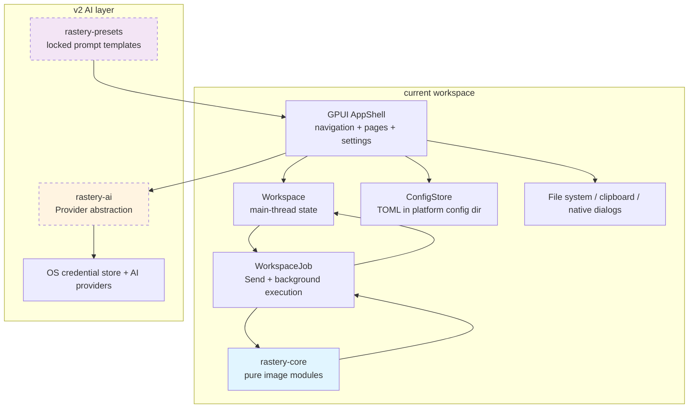
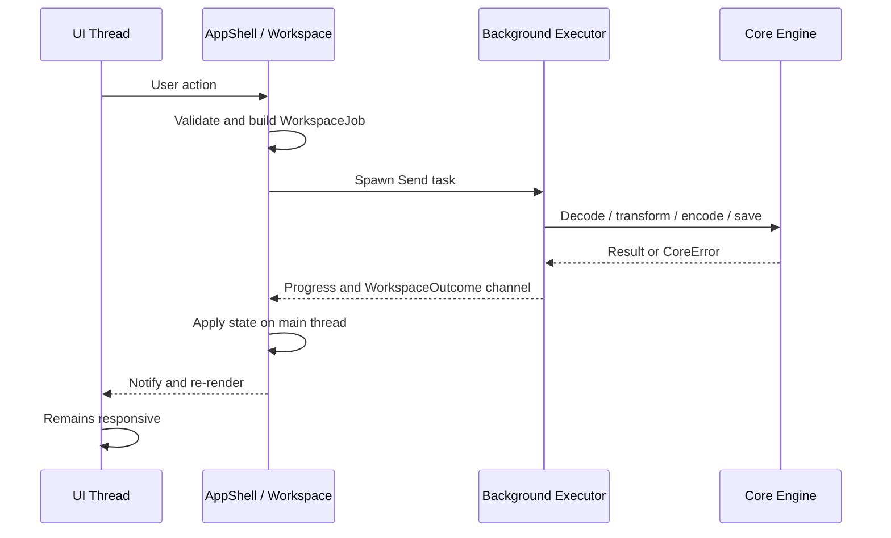

# Technical Design Document - Rastery 图像工具箱

> **本文档与 [`requirements.md`](./requirements.md) 是本项目的唯一真相源。** 领域词汇见 [`CONTEXT.md`](../../CONTEXT.md)，范围与顺序决策见 [`docs/adr/`](../adr/)。
> 早期的 `rastery-spec.md` 已冻结至 [`archive/rastery-spec-v0.3.md`](./archive/rastery-spec-v0.3.md)，**不要据此写代码**。
>
> **v1 / v2 范围**：v1 只做本地功能；v2 已按 [ADR-0004](../adr/0004-v2-provider-contract.md) 启动并建立 `rastery-ai` 与 `rastery-presets`。v2 不得削弱任何 v1 离线承诺。
>
> **截图能力已剥离**：`rastery-capture`、屏幕截图、全局热键、屏幕取色、覆盖层与截图标注不属于当前范围。截图美化仍是导入现有图片后的纯处理能力。见 [ADR-0003](../adr/0003-remove-screen-capture.md)。
>
> **建设顺序已经按 ADR-0002 执行。** 已冻结的 spec §8 曾主张 M1 骨架 → M2 core（UI 优先）；实际项目先完成 `rastery-core` 的可自动验证闭环，再接入 GPUI UI。当前不再按旧里程碑推进，而按「自动验证 → 桌面真机验收 → 发布」收敛。

## Overview

Rastery is a cross-platform desktop image processing application built with Rust and GPUI framework, targeting Windows, macOS, and Linux. The system focuses on lightweight local image processing and is organized around four product **板块**:

1. **Basic Image Processing**: Offline-first operations including editing, collage, batch processing, slicing, QR codes, EXIF management, and screenshot beautification
2. **AI Generation and Editing**: Text-to-image, image-to-image, and 12 preset AI editing scenarios
3. **Industry-Specific AI Tools**: 13 specialized tools including photo restoration, ID photos, avatars, meme generation, portrait photography, model try-on, product recoloring, promotional posters, platform adaptation, cover images, article illustrations, food photography, and interior design preview
4. **Creative Output**: GIF creation and poster design with local text rendering

### v1 Implementation Baseline Before v2 (2026-07-18)

The current candidate implementation baseline is `fffdb2c`, one local commit ahead of `origin/main@f88a939`. It includes the complete asynchronous native path-prompt change for image open, multi-image open, result save, output-directory selection, and image-watermark selection, plus direct regression coverage through the production `resolve_path_prompt` seam for cancellation, platform failure, channel closure, non-busy recovery, and immediate reuse. The local quality gate executes 60 tests and passes. Remote `f88a939` passed the Windows, macOS, and Linux quality jobs plus Windows MSI and Linux DEB smoke tests; because `fffdb2c` has not been pushed, exact-candidate CI evidence remains open. This is **not a release-ready declaration**:

| Layer | Baseline state | Verification boundary |
| --- | --- | --- |
| `rastery-core` | Implemented as pure module functions over `image::RgbaImage`; no UI, network, or global state | Fully headless-testable; local quality gate and property tests pass |
| `rastery-app` | Four-section GPUI shell, eight v1 pages, background jobs, config, i18n, drag/drop, clipboard, file export, and crop Element are wired | Type checks and headless state tests pass; Windows 11 release rendering, runtime locale switching, the native picker matrix, and all five performance metrics have partial real-machine evidence; the complete desktop matrix remains open |
| Packaging | Windows MSI, Linux DEB, and macOS DMG pipelines are defined; Windows/Linux package smoke tests exist in CI; the exact local candidate produced a 5.10MiB unsigned MSI whose administratively extracted EXE matched the release SHA-256 | Elevated Windows install/association/upgrade/uninstall, signing, notarization, and SmartScreen/Gatekeeper behavior remain release evidence |
| Acceptance evidence | Deterministic test-asset generator and JSON verifier exist; Windows 11 build 26200 partial evidence is recorded on issue #2 | `docs/testing/results/v1-desktop-acceptance.json` is not yet committed, Windows 10/macOS/Linux and package-security checks remain open, so v1 is not release-ready |

Status words used here have the meanings defined in `requirements.md` §“v1 当前验收状态”. A future change must not promote a UI item from “implemented” to “verified” using compilation alone.

The 2026-07-19 v2 implementation supersedes this source baseline: the workspace now contains four crates and all marked v2 image features are wired. Automated contract/state tests pass, while real-provider visual acceptance and a new exact-candidate desktop matrix remain open.

### Core Design Principles

- **Local-First Architecture**: All v1 本地功能 work offline; AI 功能 use BYOK (Bring Your Own Key)
- **Privacy by Design**: No telemetry or embedded API keys; credentials are stored in OS-native secure storage
- **Async-First Processing**: Heavy operations run in background executors to maintain UI responsiveness
- **Provider Abstraction**: Unified AI provider interface supporting Seedream, Google Nano Banana, and OpenAI GPT-Image. Agnes is deferred — the trait reserves extensibility only.
- **Multi-Crate Workspace**: Four crates separate UI, pure local processing, provider networking, and locked prompts

### Technology Stack

- **Framework**: GPUI for native cross-platform UI
- **Language**: Rust with strict quality gates (cargo check, clippy deny, all tests pass)
- **Rendering**: DirectX 11 + DirectWrite (Windows), Metal (macOS), GPUI backend (Linux)
- **Image Processing**: Rust image processing libraries (offline)
- **Credential Storage**: Windows Credential Manager, macOS Keychain, Linux Secret Service
- **Configuration**: TOML format in standard app data directory
- **Build**: Cargo workspace with `rastery-app`, `rastery-core`, `rastery-ai`, and `rastery-presets`

## Architecture

### High-Level Architecture Diagram



### Crate Organization

The current system is organized as a Cargo workspace with **four crates**:

#### 1. **rastery-app** (Main Application)
- GPUI application initialization, window identity, and four-section navigation
- `AppShell` orchestration, feature parameters, preview state, and settings
- `Workspace` command validation and `WorkspaceJob` / `WorkspaceOutcome` lifecycle
- Background execution for file I/O, decoding, encoding, and image processing
- Runtime Chinese / English switching through `rust-i18n` and `gpui_component::set_locale`
- Platform config persistence, drag/drop, clipboard, path prompts, and output-directory reveal
- Custom three-phase crop selection Element

#### 2. **rastery-core** (Image Processing Engine)
- Pure Rust module functions over `image::RgbaImage`
- Content-sniffed PNG/JPEG/WebP/GIF/BMP decoding and PNG/JPEG/WebP still-image encoding
- Transformations: crop, resize, rotate, collage, slice
- QR code generation and recognition
- EXIF parsing and cleaning
- Screenshot beautification effects
- GIF composition
- Watermarking
- Config serialization and deterministic output naming
- **No façade trait**: the public API is the set of typed module functions; async scheduling belongs to `rastery-app`

The following packages implement the v2 AI layer:

#### 3. **rastery-ai** (AI Service Abstraction)
- Provider trait abstraction
- Unified request/response models
- HTTPS-only Rustls transport with certificate validation
- Error mapping from provider-specific to app-level errors
- Capability declaration system
- Provider implementations: Seedream, Google Nano Banana, OpenAI GPT-Image（Agnes 暂不实现）
- **Key Trait**: `Provider` with capability declarations

#### 4. **rastery-presets** (Industry Tool Templates)
- Locked prompt template storage
- Compile-time embedding of prompts into binary
- Template organization by industry tool category
- Version-controlled prompt iteration
- **Key API**: typed edit/industry prompt renderers backed by separate compile-time template files

### Concurrency Model



### Data Flow Patterns

#### Pattern 1: Offline Image Processing
```
User Input → AppShell → Workspace::prepare → WorkspaceJob → Background Executor
                                                           ↓
UI refresh ← Workspace::apply ← WorkspaceOutcome / progress ← rastery-core + file system
```

#### Pattern 2: Native Path Prompt
```
GPUI listener → request asynchronous platform prompt → listener returns and entity borrow ends
             → await selected paths → update AppShell → prepare WorkspaceJob
```

On Windows, a synchronous native dialog can start a nested message loop and re-enter GPUI while the entity is already mutably borrowed. Therefore all file and directory pickers MUST either use GPUI's asynchronous prompt API or be scheduled only after the listener borrow has been released. This is an architectural constraint, not an optional implementation detail.

## Components and Interfaces

### Core Engine Contract (`rastery-core`)

The core contract is a typed module API over `image::RgbaImage`. There is no `ImageProcessor` façade, no async runtime, and no file-system-owning service object. Callers select a module function and pass explicit values; errors use `rastery_core::Result<T>` / `CoreError`.

| Module | Public responsibility | Principal types / functions |
| --- | --- | --- |
| `format` | Content-sniffed PNG/JPEG/WebP/GIF/BMP decode; PNG/JPEG/WebP encode | `decode`, `encode`, `OutputFormat`, `EncodeSettings`, `Quality`, `PngCompression` |
| `transform` | Exact-ratio crop, resize, fit, lossless right-angle rotation | `AspectRatio`, `CropRect`, `ResizeFilter`, `Rotation` |
| `collage` | Vertical, horizontal, and grid composition | `CollageLayout`, `CollageOptions`, `compose` |
| `slice` | Exact row × column slicing with remainder pixels preserved | `SliceGrid`, `Tile`, `slice` |
| `batch` | Per-item transform with count/order preservation and isolated failures | `BatchOp`, `BatchResult`, `process` |
| `watermark` | Image-overlay watermark at bottom-right or tiled | `Position`, `apply` |
| `beautify` | Rounded corners, padding, background, border, and shadow | `BeautifyParams`, `Background`, `Border`, `Shadow`, `beautify` |
| `animation` | Forward, reverse, and ping-pong GIF encoding | `GifParams`, `Playback`, `compose` |
| `qr` | QR generation and recognition | `QrOptions`, `ErrorCorrection`, `generate`, `decode` |
| `exif` | Human-readable EXIF view and container-level metadata stripping | `ExifData`, `GpsCoordinates`, `read`, `strip`, `has_exif` |
| `config` | v1 TOML data model and round-trip serialization | `AppConfig`, `Language`, `to_toml`, `from_toml` |
| `naming` | Sanitized deterministic batch and tile filenames | `sanitize_stem`, `batch_filename`, `tile_filename` |

`rastery-core` MUST remain synchronous and pure. Requirement 3 async behavior is fulfilled by the application layer scheduling these functions on GPUI's background executor; adding an async executor or UI text to the core would violate the crate boundary.

### Application Contract (`rastery-app`)

| Component | Responsibility | Threading rule |
| --- | --- | --- |
| `AppShell` | Own active section/page, settings, controls, preview orchestration, path prompts, clipboard, and locale changes | GPUI main thread only |
| `Workspace` | Hold source images/bytes, result, preview, status, info, and busy state; validate commands and apply outcomes | Mutated on main thread only |
| `WorkspaceCommand` | Express user intent such as transform, collage, slice, QR, EXIF, GIF, batch, save, or open | Constructed on main thread |
| `WorkspaceJob` | Own all data needed for file I/O, decode, transform, encode, and export | Must be safe to move to the background executor |
| `WorkspaceOutcome` | Return result data, errors, clipboard payload, and output-directory effects | Applied to `Workspace` on main thread |
| `Selection` / crop Element | Store normalized crop rectangle; implement GPUI `request_layout`, `prepaint`, and `paint`; support move and eight resize grips | Events and rendering on main thread |
| `FeatureParams` | Hold bounded page parameters and translate them to core types | Main thread; pure conversion helpers are unit-tested |
| `ConfigStore` | Resolve the platform config directory; atomically load/save TOML with corruption fallback | Short config operations may run during app lifecycle; image work never routes through it |
| `UiMessage` / `ErrorKind` | Map internal outcomes to localized user-facing state | User text is resolved through i18n keys |

The job lifecycle is:

1. A listener converts UI input into a `WorkspaceCommand`.
2. `Workspace::prepare` validates state and produces a self-contained `WorkspaceJob`.
3. `AppShell` runs the job on `cx.background_executor()` and receives progress / completion through an async channel.
4. `Workspace::apply` updates state after the job finishes; only then does GPUI re-render.

Native path prompts are outside `WorkspaceJob`: selection happens asynchronously, after the listener's mutable entity borrow is released. File reads and image decoding begin only after concrete paths have been returned.

### v2 Provider and Preset Interfaces

The implemented boundary is:

- a `Provider` abstraction with capability declarations, text-to-image, image-to-image, edit, and normalized errors;
- provider credentials stored only in OS credential stores;
- locked prompt templates compiled into `rastery-presets` and selected by industry-tool **档位**;
- `rastery-core` remains independent of both network crates; only `rastery-app` orchestrates them.

Provider request schemas and models are frozen by ADR-0004 and contract-tested through injected fake transports. A future model or endpoint upgrade is an explicit research/ADR task.

## Data Models

### Image and Encoding Model

- Internal decoded pixels use `image::RgbaImage` (`u8` RGBA).
- `OutputFormat` contains `Png`, `Jpeg`, and `Webp`; GIF is produced by `animation::compose`, while BMP/GIF remain readable inputs.
- `EncodeSettings` binds legal settings to the target format: PNG compression, JPEG quality, lossy WebP quality, or lossless WebP.
- `Quality` is validated in the inclusive range 1–100 and passed to the encoder without remapping.
- JPEG export flattens alpha onto opaque white; PNG and lossless WebP preserve alpha.

### Geometry and Effect Model

- `AspectRatio` stores a reduced integer pair. The five v1 presets are 1:1, 4:5, 9:16, 16:9, and 21:9.
- `CropRect` is a checked pixel-space rectangle; the crop Element stores a normalized rectangle and converts it against current image dimensions.
- `SliceGrid` and `CollageOptions` reject zero or invalid dimensions instead of silently changing user input.
- Beautification and watermark parameters are explicit value types; all effects return a new image and do not mutate the source.

### Workspace State Model

`Workspace` keeps decoded inputs and names in shared immutable collections, preserves original container bytes for EXIF, and stores at most one current image result or encoded result. `busy` prevents overlapping jobs. Failures map to `UiMessage` while leaving the workspace reusable.

Batch outputs retain the input index, success/failure partition, and original source stem. Naming sanitization guarantees that generated files remain inside the selected directory.

### Configuration Model

`AppConfig` contains only:

- `default_export_format`;
- `default_export_quality`;
- `default_png_compression`;
- `language` (`zh-CN` or `en` at runtime);
- `last_output_dir: Option<PathBuf>`.
- `default_provider`;
- non-secret local `generation_history` records.

It intentionally contains no API key or prompt text. `ConfigStore` writes through a temporary file and backup/rename sequence, and a missing or corrupt config falls back to defaults with a localized warning.

### History and Credentials

Generation history is non-secret TOML data and can be cleared in Settings. Provider credentials use `keyring` and are stored only by Windows Credential Manager, macOS Keychain, or Linux Secret Service; secret wrappers are redacted, zeroized on drop, and never serialized or logged.

## Error Handling

### Error Layers

`rastery-core` exposes one structured `CoreError` with variants for image decode/encode, WebP, disk space, I/O, QR encode/decode, EXIF, GIF encode, config parse/serialize, and invalid arguments. Public core operations return `Result` and do not panic for user input.

`rastery-app` does not expose a speculative application-wide error enum. Background jobs convert concrete failures into semantic `ErrorKind` categories:

- unsupported format or corrupted image;
- encode or image operation failure;
- EXIF or QR failure;
- disk full, permission, or general I/O;
- config or clipboard failure.

`UiMessage` stores semantic state and data, never translated strings. Rendering resolves the i18n key at display time, so an existing error changes language immediately when the locale changes.

### Recovery Rules

1. An individual batch item failure is recorded with its source name and does not stop remaining items.
2. A failed `WorkspaceJob` clears the busy state and leaves the workspace usable for the next command.
3. Missing config silently uses defaults; unreadable or invalid config uses defaults and displays a reset warning.
4. Save failures preserve the in-memory result so the user can choose another destination.
5. Invalid numeric or empty text input is rejected before a background job is spawned.
6. AI/provider/credential failures map into localized semantic categories without exposing provider bodies or credentials.

## Testing Strategy

### Automated Baseline

The 2026-07-19 workspace baseline executes 80 tests: `rastery-ai` provider/security/transport contracts, `rastery-presets` embedded-template coverage, the complete v1 core property suite, and app state/orchestration tests including AI masks, exact business dimensions, config secret exclusion, platform local cropping, and poster composition.

Property-based testing is required for pure transformations and invariants. Example-based unit tests are preferred for state transitions, platform-independent orchestration, validation, and known regressions. UI pixels, interaction feel, native dialogs, clipboard interoperability, signing, and timing are desktop acceptance concerns.

### CI and Package Verification

Normal CI performs:

- icon-source and generated-asset consistency checks;
- `cargo check`, Clippy with denied warnings, and tests on Windows, macOS, and Linux;
- unsigned Windows MSI build plus installation, association, shortcut, and uninstall smoke;
- Linux amd64 DEB build plus content, install, and uninstall smoke.

The release workflow additionally builds signed Windows artifacts, a signed/notarized macOS DMG, and the Linux package, enforces the 30 MiB limit, and refuses to start without current desktop acceptance evidence.

### Desktop Acceptance

`docs/testing/v1-desktop-acceptance.md` is the normative procedure for work that headless tests cannot prove. The committed result must include:

- Windows, macOS, Linux X11, and Linux Wayland environment details and pass results;
- the complete common-feature and platform-specific check sets;
- at least three samples for every performance metric;
- deterministic generated-resource and EXIF-photo SHA-256 values;
- package size, signing, notarization, install, uninstall, and platform security conclusions.

`scripts/verify_desktop_acceptance.py` rejects missing, stale, incomplete, or out-of-budget evidence. Windows 11 build 26200 has partial release-build evidence for DirectWrite Chinese/English rendering, the complete native picker path matrix, cold start, 50MP preview, beautify preview, and 100-image responsiveness/progress. The exact-candidate unsigned MSI also builds within budget and passes administrative extraction with a byte-identical release EXE; a non-elevated per-machine install was intentionally stopped by Windows Error 1925 without leaving installed state. The baseline still has only an example JSON, and Windows 10, macOS, Linux, elevated package integration, and signed package checks remain open, so desktop acceptance is not complete.

### Quality Gates

Every task must pass the repository Definition of Done:

1. `cargo check`
2. `cargo clippy -- -D warnings`
3. `cargo test`

CI may add `--workspace` / `--all-targets`, but v1 MUST NOT enable `webview` or `inspector` features because they introduce a browser engine and violate the dependency boundary.

## Correctness Properties

*A property is a characteristic or behavior that should hold true across all valid executions of a system—essentially, a formal statement about what the system should do. Properties serve as the bridge between human-readable specifications and machine-verifiable correctness guarantees.*

### Property Reflection

After analyzing the 442 acceptance criteria, I identified properties suitable for property-based testing in the core image processing engine. The following reflection eliminates redundancy:

**Redundancy Analysis:**
1. **EXIF Cleaning Properties**: Requirements 2.7-2.8, 11.7-11.10, and 60.5-60.6 all specify EXIF GPS/device removal. These can be combined into a single comprehensive property.
2. **Round-Trip Properties**: Requirements 10 (QR codes), 38 (lossless formats), 52 (explicit round-trip), and 53 (config) all specify encode-decode consistency. Each is distinct (QR vs PNG vs config) so all are retained.
3. **Batch Invariants**: Requirements 8 and 54 both specify batch processing count/order invariants. These are overlapping and can be combined.
4. **Removed Capture Coordinates**: Requirements 13 and 48 were removed by ADR-0003, so no DPI capture property remains in v1.
5. **Idempotence**: Requirement 56 lists multiple idempotent operations (EXIF clean, PNG-to-PNG, config reload). While conceptually similar, each tests different subsystems, so all are retained.

### Property 1: Lossless Image Format Round-Trip Preserves Pixels

*For any* valid image with pixel data, encoding in lossless PNG format and then decoding SHALL produce pixel data identical to the original input.

*For any* valid image with pixel data, encoding in lossless WebP format and then decoding SHALL produce pixel data identical to the original input.

**Validates: Requirements 38.7, 38.8, 52.7, 52.8**

### Property 2: QR Code Round-Trip Preserves Content

*For any* text string, encoding as a QR code in PNG format and then parsing the generated QR code image SHALL decode to the original text string exactly.

*For any* URL string, the round-trip operation (generate QR code → save as PNG → parse) SHALL preserve the original URL exactly.

**Validates: Requirements 10.9, 10.10, 52.11, 52.12**

### Property 3: Configuration Serialization Round-Trip Preserves Data

*For any* valid AppConfig object, serializing to TOML format and then parsing back SHALL produce an equivalent configuration object.

**Validates: Requirements 32.1, 53.3**

### Property 4: EXIF Cleaning Removes GPS and Device Metadata

*For any* image with EXIF metadata, after EXIF cleaning, the output image SHALL contain zero GPS-related EXIF tags.

*For any* image with EXIF metadata, after EXIF cleaning, the output image SHALL contain zero device identification EXIF tags.

*For any* image, EXIF cleaning SHALL preserve the pixel data exactly while removing only metadata.

**Validates: Requirements 2.7, 2.8, 11.7, 11.8, 55.5, 60.5, 60.6**

### Property 5: Image Slicing Produces Correct Tile Count

*For any* image and grid configuration with M rows and N columns, slicing SHALL produce exactly M × N output tiles.

**Validates: Requirements 9.5, 9.6, 55.4**

### Property 6: Collage Composition Contains All Input Images

*For any* list of N images and any collage layout mode (vertical, horizontal, grid), the output collage SHALL contain exactly N visible image regions.

**Validates: Requirements 7.8**

### Property 7: Grid Collage Column Count Matches Configuration

*For any* list of N images composed in grid mode with C columns, the resulting grid SHALL have ⌈N/C⌉ rows and the specified C columns (except possibly the last row).

**Validates: Requirements 7.5**

### Property 8: Batch Processing Preserves Input Count

*For any* batch of N images processed with any batch operation, the sum of successful outputs and failed items SHALL equal N.

**Validates: Requirements 8.7, 8.8, 54.6**

### Property 9: Batch Processing Preserves Input Order

*For any* ordered list of images in a batch operation, the output files SHALL maintain the same order as the input list.

**Validates: Requirements 54.5**

### Property 10: Batch Format Conversion Preserves Dimensions

*For any* batch of images undergoing format conversion, each output image SHALL have dimensions identical to its corresponding input image.

**Validates: Requirements 54.1**

### Property 11: Batch Compression Preserves Dimensions

*For any* batch of images undergoing compression, each output image SHALL have dimensions identical to its corresponding input image.

**Validates: Requirements 54.2**

### Property 12: Batch Resize Preserves Image Count

*For any* batch of N images undergoing resize with a scale factor, the output SHALL contain exactly N images.

**Validates: Requirements 54.3**

### Property 13: Batch Watermark Preserves Image Count

*For any* batch of N images undergoing watermark application, the output SHALL contain exactly N images.

**Validates: Requirements 54.4**

### Property 14: Cropped Image Matches Selected Aspect Ratio

*For any* image cropped with a selected aspect ratio preset, the output image aspect ratio SHALL match the preset within 0.1% tolerance.

**Validates: Requirements 55.1**

### Property 15: 360-Degree Rotation Is Identity

*For any* image rotated by 360 degrees, the output image SHALL be visually identical to the input image.

**Validates: Requirements 55.2**

### Property 16: Removed with Screen Capture

The DPI/capture property is no longer part of the current scope (ADR-0003).

### Property 17: GIF Frame Count Matches Input

*For any* non-empty list of N images composed into a GIF, forward and reverse playback SHALL contain exactly N frames; ping-pong playback SHALL contain one frame when N=1 and 2N−1 frames when N>1.

**Validates: Requirements 15.6**

### Property 18: Beautification with Transparent Background Produces PNG with Transparency

*For any* image beautified with transparent background selected, the output SHALL be a PNG file with true transparency outside the content area (e.g., outside rounded corners).

**Validates: Requirements 12.10**

### Property 19: Batch Filename Generation Is Sequential and Unique

*For any* v1 batch or slicing operation producing multiple output files from N inputs, the filenames SHALL contain sanitized source stems plus sequential identifiers, and slicing names SHALL additionally contain grid positions; every generated path SHALL remain inside the selected output directory.

**Validates: Requirements 41.3, 41.4**

### Property 20: EXIF Cleaning Is Idempotent

*For any* image, applying EXIF cleaning twice SHALL produce output identical to applying it once.

**Validates: Requirements 56.1**

### Property 21: PNG-to-PNG Conversion Is Idempotent

*For any* PNG image, converting from PNG to PNG format SHALL produce output equivalent to the input.

**Validates: Requirements 56.2**

### Property 22: QR Code Re-Encoding Is Idempotent

*For any* text string, encoding as QR code, decoding, and re-encoding SHALL produce a QR code that decodes to the same text.

**Validates: Requirements 56.3**

### Property 23: Configuration Save-Reload Is Idempotent

*For any* configuration, saving to file and immediately reloading SHALL produce a configuration equal to the original.

**Validates: Requirements 56.4**

### Property 24: Invalid Image File Returns Error Without Crash

*For any* invalid or corrupted image file, attempting to open SHALL return an error without crashing the application.

**Validates: Requirements 57.1**

### Property 25: Corrupted QR Code Returns Error Without Crash

*For any* corrupted QR code image, attempting to parse SHALL return a decoding error without crashing the application.

**Validates: Requirements 57.2**

### Property 26: Invalid TOML Returns Error Without Crash

*For any* invalid TOML syntax in a configuration file, attempting to parse SHALL return a parse error without crashing the application.

**Validates: Requirements 57.6**

### Property 27: Error Conditions Maintain Valid Application State

*For any* v1 error condition (file I/O, parsing, encoding, decoding, or image-operation errors), the application SHALL remain in a valid state allowing continued operation after error handling.

**Validates: Requirements 57.7, 57.8**

### Property 28: Screenshot Beautification Padding Increases Dimensions Predictably

*For any* image beautified with inner padding P, the output width and height SHALL each increase by exactly 2P pixels. Corner radius changes the alpha mask, not the outer dimensions.

**Validates: Requirements 55.6**

### [v2] Property 29: Credential Storage Never Writes API Keys to Plaintext Files

*For any* API key storage operation, the Rastery_System SHALL NOT write the API key to the configuration file or log files.

**Validates: Requirements 60.2, 60.3, 60.4**

### [v2] Property 30: Network Requests to AI Providers Use HTTPS

*For all* network requests to AI providers, the AI_Engine SHALL use HTTPS protocol.

**Validates: Requirements 60.7**

## Implementation Approach

The original sprint list described a greenfield build. The codebase has moved past that stage, so the execution plan is now organized by verification state rather than by hypothetical implementation order.

### [v1] Stage A — Core Engine: Implemented and Automatically Verified

Complete scope:

- workspace and two-crate boundary;
- PNG/JPEG/WebP encoding and PNG/JPEG/WebP/GIF/BMP decoding;
- crop, resize, rotation, collage, slice, QR, EXIF, beautification, GIF, watermark, batch, config, and naming;
- v1 correctness properties and regression tests;
- cross-platform CI quality jobs.

Exit criterion: `rastery-core` remains pure, synchronous, network-free, and green under all three quality gates on Windows, macOS, and Linux.

### [v1] Stage B — Desktop Application: Implemented, Stabilization and Real-Machine Acceptance Open

Implemented scope:

- four **板块** and v2 placeholders;
- eight v1 pages connected to the core;
- runtime Chinese / English switching;
- background image jobs with progress and reusable error state;
- config persistence and recovery;
- file open, drag/drop, clipboard paste/copy, export, and output-directory reveal;
- all native open/save/directory flows use GPUI asynchronous path prompts, with selected paths passed to `Workspace` before file I/O or codec work begins;
- crop selection custom Element with normalized geometry;
- deterministic acceptance assets and result verifier.

Remaining stabilization work:

1. Repeat the now-passing Windows 11 picker regression matrix on Windows 10; the Windows 11 release build covered open, multi-open, save, output-directory, and image-watermark flows without `RefCell already borrowed`.
2. Run the complete feature matrix on Windows 10/11 x64, macOS, Linux X11, and Linux Wayland. The current Windows 11 evidence is partial and does not replace the full matrix.
3. Record any rendering, focus, DPI, clipboard, dialog, drag/drop, or file-manager defects as implementation work; compilation and partial Windows evidence are not proof for untested behaviors.

Exit criterion: all common and platform-specific checks in `v1-desktop-acceptance.md` pass and are represented in the committed JSON evidence.

### [v1] Stage C — Performance and Release: Open

1. Generate the deterministic acceptance assets and record their SHA-256. Completed reference: `b3f147092b8ca40044d4ba9dbb7c29f595038ff85de80c232332506adf5d2133`.
2. Measure at least three release-build samples for cold start, 50MP preview, beautify preview latency, 100-image click response, and progress frequency on the required platforms. Windows 11 is complete and within budget; Windows 10, macOS, and Linux remain open.
3. Optimize any metric outside the requirement budget, then repeat the affected platform evidence.
4. Build the Windows MSI, macOS DMG, and Linux DEB; verify size, install/uninstall, associations, shortcuts, runtime dependencies, signing, and notarization. The exact-candidate Windows MSI build, size, and extracted payload integrity pass; elevated install integration and signing remain open.
5. Commit `docs/testing/results/v1-desktop-acceptance.json` for the exact release-affecting source baseline and run its verifier.
6. Only after all gates pass may a `v*` tag create a release.

Exit criterion: the release workflow accepts the evidence and all platform artifacts pass their jobs. Until then the product status remains pre-release even if every automated test is green.

### [v2] Stage D — AI 功能: Implemented, Real-Provider Acceptance Open

ADR-0004 and fresh official-provider research established the contract. The four-crate implementation includes secure credentials, three providers, capability-driven UI, 12 edit presets, 13 industry tools, poster composition, exact output post-processing, history, and semantic failures.

Exit criterion: execute [`v2-ai-acceptance.md`](../testing/v2-ai-acceptance.md) with funded real-provider accounts, verify every **保持不变项** and content-filter/error path, then repeat the exact-candidate desktop and package matrix. Automated fake-transport tests cannot promote subjective generated output to “verified”.

v2 MUST NOT weaken the v1 guarantees: every 本地功能 remains usable without network connectivity, API keys, provider initialization, or telemetry.

## Maintenance and Evolution

### Dependency and Version Strategy

- Keep `gpui = "=0.2.2"` and `gpui-component = "=0.5.1"` exactly locked.
- Treat a synchronized GPUI / gpui-component upgrade as its own change with regenerated `vendor-docs/`, full CI, and repeated desktop acceptance.
- Do not enable `webview` or `inspector` features.
- Keep the local `proc-macro-error2` compatibility patch documented and remove it only when a verified synchronized upgrade makes it unnecessary.
- Use `PathBuf` for platform paths and preserve the four-crate dependency boundary.

### Code Quality Standards

- All tasks pass `cargo check`, `cargo clippy -- -D warnings`, and `cargo test`.
- CI runs the workspace and all targets on Windows, macOS, and Linux.
- `rastery-core` public operations return structured errors for invalid user input and contain no user-visible localized text.
- Property tests run at least 100 cases, keep shrinking enabled, and preserve generated regression cases for deterministic replay.
- Every property test identifies the corresponding property number in a nearby comment.
- Existing user changes in a dirty worktree are never overwritten as part of unrelated work.

### Property-Based Testing Configuration

- **Library**: `proptest` (currently 1.11.x).
- **Scope**: pure core transformations, serialization, naming, and state invariants that can be expressed without a desktop.
- **Cases**: at least 100 per property; the library default may be higher.
- **Shrinking**: enabled.
- **Replay**: committed `*.proptest-regressions` cases and explicit seeds when diagnosing CI-only failures.

The baseline implements Properties 1–15 and 17–30. Property 16 was removed with screen capture; Properties 29–30 are covered by credential/config and HTTPS transport tests.

### Verification Layers

| Layer | Purpose | Current mechanism |
| --- | --- | --- |
| Pure behavior | Pixel, count, order, round-trip, idempotence, and error invariants | `rastery-core` unit and property tests |
| Headless app state | Parameters, config, job outcomes, naming containment, and crop math | `rastery-app` unit tests |
| Cross-platform build | API use, cfg paths, linking, package structure | GitHub Actions on three operating systems |
| Desktop behavior | Rendering, interaction, dialogs, clipboard, drag/drop, file manager, performance | Four-environment desktop acceptance JSON |
| Release trust | Signing, notarization, installation, uninstall, artifact size | release workflow plus real-machine checks |

### Future Extensions (Out of Current Scope)

- the three video placeholders;
- optional screen capture only after a new ADR re-evaluates package size and platform dependencies;
- AI providers beyond the three initially planned providers;
- cloud sync or a plugin system.

---

## Document Metadata

- **Feature Name**: rastery
- **Spec Type**: Feature
- **Workflow Type**: Requirements-First
- **Document Version**: 1.3
- **Total Requirements Covered**: 60
- **Total Acceptance Criteria Addressed**: 442
- **Correctness Properties Defined**: 29 active (27 v1 + 2 v2), plus removed Property 16 placeholder
- **Automated Baseline**: 80 workspace tests on the 2026-07-19 local v2 implementation
- **Last Updated**: 2026-07-19
- **Status**: v1 and v2 image implementation complete; real-provider, desktop, package, and release acceptance open
