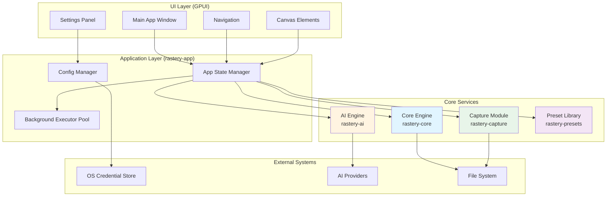
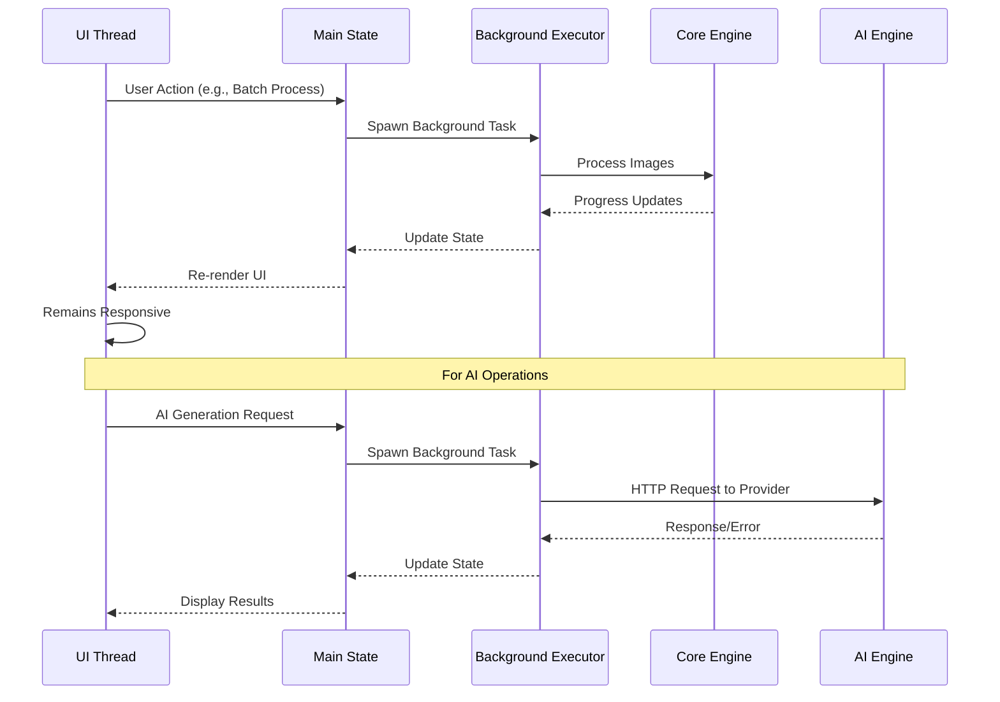

# Technical Design Document - Rastery 图像工具箱

## Overview

Rastery is a cross-platform desktop image processing application built with Rust and GPUI framework, targeting Windows, macOS, and Linux. The system integrates screenshot capabilities with comprehensive image processing features, organized around four major functional modules:

1. **Basic Image Processing**: Offline-first operations including editing, collage, batch processing, slicing, QR codes, EXIF management, and screenshot beautification
2. **AI Generation and Editing**: Text-to-image, image-to-image, and 12 preset AI editing scenarios
3. **Industry-Specific AI Tools**: 12 specialized tools including photo restoration, ID photos, avatars, meme generation, portrait photography, model try-on, product recoloring, promotional posters, platform adaptation, cover images, article illustrations, food photography, and interior design preview
4. **Creative Output**: GIF creation and poster design with local text rendering

### Core Design Principles

- **Local-First Architecture**: All basic features work offline; AI features use BYOK (Bring Your Own Key) model
- **Privacy by Design**: No telemetry, no embedded API keys, credentials stored in OS-native secure storage
- **Async-First Processing**: Heavy operations run in background executors to maintain UI responsiveness
- **Provider Abstraction**: Unified AI provider interface supporting multiple services (Seedream, Google Nano Banana, OpenAI GPT-Image, Agnes)
- **Multi-Crate Workspace**: Modular architecture separating concerns (app, core, ai, capture, presets)

### Technology Stack

- **Framework**: GPUI for native cross-platform UI
- **Language**: Rust with strict quality gates (cargo check, clippy deny, all tests pass)
- **Rendering**: DirectX 11 + DirectWrite (Windows), Metal (macOS), GPUI backend (Linux)
- **Image Processing**: Rust image processing libraries (offline)
- **Credential Storage**: Windows Credential Manager, macOS Keychain
- **Configuration**: TOML format in standard app data directory
- **Build**: Cargo workspace with 5 crates

## Architecture

### High-Level Architecture Diagram



### Crate Organization

The system is organized as a Cargo workspace with five crates:

#### 1. **rastery-app** (Main Application)
- GPUI application initialization and window management
- Global state management and app lifecycle
- UI composition and routing between feature modules
- Integration of all service crates

#### 2. **rastery-core** (Image Processing Engine)
- Pure Rust image processing operations
- Format encoding/decoding (PNG, JPEG, WebP, GIF, BMP)
- Transformations: crop, resize, rotate, collage, slice
- QR code generation and recognition
- EXIF parsing and cleaning
- Screenshot beautification effects
- GIF composition
- Watermarking
- **Key Trait**: `ImageProcessor` for processing operations

#### 3. **rastery-ai** (AI Service Abstraction)
- Provider trait abstraction
- Unified request/response models
- HTTP client with retry logic
- Error mapping from provider-specific to app-level errors
- Capability declaration system
- Provider implementations: Seedream, Google Nano Banana, OpenAI GPT-Image, Agnes
- **Key Trait**: `Provider` with capability declarations

#### 4. **rastery-capture** (System Integration)
- Global hotkey registration
- Multi-display detection and Physical_Pixel coordinate calculation
- Overlay window creation for screenshot selection
- Screen capture with DPI awareness (100%, 125%, 150%, 200%)
- Color picker with pixel-perfect sampling
- Clipboard integration
- **Key Trait**: `CaptureDevice` for platform-specific implementations

#### 5. **rastery-presets** (Industry Tool Templates)
- Locked prompt template storage
- Compile-time embedding of prompts into binary
- Template organization by industry tool category
- Version-controlled prompt iteration
- **Key API**: `get_preset(tool: IndustryTool, variant: Option<String>) -> &'static str`

### Concurrency Model



### Data Flow Patterns

#### Pattern 1: Offline Image Processing
```
User Input → UI Layer → App State → Background Executor → Core Engine → File System
                                                               ↓
                                          Progress Callback ← State Update ← UI Refresh
```

#### Pattern 2: AI Generation
```
User Input + API Key → UI Layer → App State → Background Executor → AI Engine → Provider API
                                                                          ↓
                          Credential Store ← Config Manager        Error Mapping
                                                                          ↓
                          UI Refresh ← State Update ← Progress/Result Callback
```

#### Pattern 3: Screenshot Capture
```
Global Hotkey → Capture Module → Overlay Windows (per display) → User Selection
                                                                       ↓
                Physical Pixel Calculation → Screen Capture → Annotation Tools
                                                                       ↓
                File + Clipboard ← Core Engine (compression) ← Captured Image
```

## Components and Interfaces

### Core Engine Module (rastery-core)

#### ImageProcessor Trait
```rust
pub trait ImageProcessor {
    fn crop(&self, image: &DynamicImage, region: CropRegion) -> Result<DynamicImage>;
    fn resize(&self, image: &DynamicImage, dimensions: (u32, u32)) -> Result<DynamicImage>;
    fn encode(&self, image: &DynamicImage, format: OutputFormat, quality: Quality) -> Result<Vec<u8>>;
    fn decode(&self, data: &[u8]) -> Result<DynamicImage>;
    fn apply_watermark(&self, image: &DynamicImage, watermark: Watermark) -> Result<DynamicImage>;
    fn beautify(&self, image: &DynamicImage, params: BeautifyParams) -> Result<DynamicImage>;
}
```

#### Collage Composer
```rust
pub struct CollageComposer;

impl CollageComposer {
    pub fn compose_vertical(&self, images: Vec<DynamicImage>) -> Result<DynamicImage>;
    pub fn compose_horizontal(&self, images: Vec<DynamicImage>) -> Result<DynamicImage>;
    pub fn compose_grid(&self, images: Vec<DynamicImage>, params: GridParams) -> Result<DynamicImage>;
}

pub struct GridParams {
    pub columns: u32,
    pub spacing: u32,
    pub background_color: Rgba<u8>,
}
```

#### Slicer
```rust
pub struct ImageSlicer;

impl ImageSlicer {
    pub fn slice(&self, image: &DynamicImage, rows: u32, cols: u32) -> Result<Vec<ImageTile>>;
}

pub struct ImageTile {
    pub image: DynamicImage,
    pub position: (u32, u32),  // row, col
}
```

#### QR Code Module
```rust
pub struct QrCodeGenerator;
pub struct QrCodeParser;

impl QrCodeGenerator {
    pub fn generate(&self, content: &str, params: QrParams) -> Result<DynamicImage>;
}

impl QrCodeParser {
    pub fn parse(&self, image: &DynamicImage) -> Result<String>;
}

pub struct QrParams {
    pub size: u32,
    pub error_correction: ErrorCorrection,
    pub foreground: Rgba<u8>,
    pub background: Rgba<u8>,
}
```

#### EXIF Module
```rust
pub struct ExifReader;
pub struct ExifCleaner;

pub struct ExifData {
    pub camera_model: Option<String>,
    pub focal_length: Option<f32>,
    pub aperture: Option<f32>,
    pub shutter_speed: Option<String>,
    pub iso: Option<u32>,
    pub gps_coordinates: Option<(f64, f64)>,
}

impl ExifReader {
    pub fn read(&self, image_path: &Path) -> Result<ExifData>;
}

impl ExifCleaner {
    pub fn clean(&self, image: &DynamicImage) -> Result<DynamicImage>;
    // Removes GPS and device identification metadata
}
```

#### Batch Processor
```rust
pub struct BatchProcessor;

pub enum BatchOperation {
    FormatConversion(OutputFormat, Quality),
    Compression(Quality),
    Resize(ResizeMode),
    Watermark(Watermark),
}

pub struct BatchResult {
    pub successful: Vec<ProcessedItem>,
    pub failed: Vec<FailedItem>,
}

impl BatchProcessor {
    pub async fn process<F>(
        &self,
        images: Vec<PathBuf>,
        operation: BatchOperation,
        progress_callback: F,
    ) -> Result<BatchResult>
    where
        F: Fn(usize, usize) + Send + 'static;
}
```

#### GIF Composer
```rust
pub struct GifComposer;

pub struct GifParams {
    pub frame_delay_ms: u32,  // 100-800ms
    pub dimensions: Option<(u32, u32)>,
    pub playback_mode: PlaybackMode,
}

pub enum PlaybackMode {
    Forward,
    Reverse,
    PingPong,
}

impl GifComposer {
    pub fn compose(&self, frames: Vec<DynamicImage>, params: GifParams) -> Result<Vec<u8>>;
}
```

### AI Engine Module (rastery-ai)

#### Provider Trait
```rust
#[async_trait]
pub trait Provider: Send + Sync {
    fn name(&self) -> &str;
    fn capabilities(&self) -> ProviderCapabilities;
    
    async fn text_to_image(&self, request: TextToImageRequest) -> Result<GenerationResponse>;
    async fn image_to_image(&self, request: ImageToImageRequest) -> Result<GenerationResponse>;
    async fn edit_image(&self, request: EditImageRequest) -> Result<GenerationResponse>;
}

pub struct ProviderCapabilities {
    pub max_reference_images: u32,
    pub supported_aspect_ratios: Vec<AspectRatio>,
    pub max_generation_count: u32,
    pub supports_text_to_image: bool,
    pub supports_image_to_image: bool,
    pub supports_region_editing: bool,
}
```

#### Request Models
```rust
pub struct TextToImageRequest {
    pub prompt: String,
    pub aspect_ratio: AspectRatio,
    pub count: u32,
    pub api_key: String,
}

pub struct ImageToImageRequest {
    pub prompt: String,
    pub reference_images: Vec<Vec<u8>>,  // PNG/JPEG encoded
    pub aspect_ratio: AspectRatio,
    pub count: u32,
    pub api_key: String,
}

pub struct EditImageRequest {
    pub base_image: Vec<u8>,
    pub prompt: String,
    pub mask: Option<Vec<u8>>,  // For region-based editing
    pub api_key: String,
}

pub struct GenerationResponse {
    pub images: Vec<Vec<u8>>,  // PNG encoded results
}
```

#### Error Types
```rust
pub enum AIError {
    InvalidApiKey,
    InsufficientBalance,
    NetworkFailure(String),
    ContentBlocked,
    RateLimitExceeded,
    UnsupportedOperation,
    ProviderError(String),
}
```

#### Provider Implementations
```rust
pub struct SeedreamProvider {
    client: reqwest::Client,
}

pub struct GoogleNanoBananaProvider {
    client: reqwest::Client,
}

pub struct OpenAIGPTImageProvider {
    client: reqwest::Client,
}

pub struct AgnesProvider {
    client: reqwest::Client,
}

// Each implements the Provider trait
```

### Capture Module (rastery-capture)

#### CaptureDevice Trait
```rust
#[async_trait]
pub trait CaptureDevice: Send + Sync {
    fn register_hotkey(&self, hotkey: Hotkey) -> Result<()>;
    fn unregister_hotkey(&self) -> Result<()>;
    fn detect_displays(&self) -> Vec<DisplayInfo>;
    async fn capture_region(&self, display: DisplayId, region: PhysicalRegion) -> Result<RgbaImage>;
    async fn sample_pixel(&self, display: DisplayId, position: PhysicalPoint) -> Result<Rgba<u8>>;
}

pub struct DisplayInfo {
    pub id: DisplayId,
    pub physical_resolution: (u32, u32),
    pub logical_resolution: (u32, u32),
    pub dpi_scale: f32,  // 1.0, 1.25, 1.5, 2.0
    pub position: (i32, i32),
}

pub struct PhysicalRegion {
    pub x: u32,
    pub y: u32,
    pub width: u32,
    pub height: u32,
}

pub struct PhysicalPoint {
    pub x: u32,
    pub y: u32,
}
```

#### Overlay Window Manager
```rust
pub struct OverlayManager;

impl OverlayManager {
    pub fn create_overlays(&self, displays: &[DisplayInfo]) -> Vec<OverlayWindow>;
}

pub struct OverlayWindow {
    pub display_id: DisplayId,
    pub handle: WindowHandle,
}
```

#### Annotation Tools
```rust
pub enum AnnotationTool {
    Brush { width: u32, color: Rgba<u8> },
    Mosaic { block_size: u32 },
    Text { font: Font, size: u32, color: Rgba<u8> },
}

pub struct AnnotationLayer {
    annotations: Vec<Annotation>,
}

impl AnnotationLayer {
    pub fn add_brush_stroke(&mut self, points: Vec<Point>, params: BrushParams);
    pub fn add_mosaic_region(&mut self, region: Region, block_size: u32);
    pub fn add_text(&mut self, position: Point, text: String, params: TextParams);
    pub fn render(&self, base_image: &mut RgbaImage);
}
```

#### Clipboard Integration
```rust
pub struct ClipboardManager;

impl ClipboardManager {
    pub fn copy_image(&self, image: &RgbaImage) -> Result<()>;
    pub fn copy_text(&self, text: &str) -> Result<()>;
    pub fn get_image(&self) -> Result<Option<RgbaImage>>;
}
```

### Preset Library Module (rastery-presets)

#### Preset API
```rust
pub enum IndustryTool {
    PhotoRestoration,
    IdPhoto,
    Avatar,
    MemeGenerator,
    Portrait,
    ModelTryOn,
    ProductRecolor,
    PromotionalPoster,
    PlatformAdapter,
    CoverImage,
    ArticleIllustration,
    FoodEnhancement,
    InteriorDesign,
}

pub enum IdPhotoSpec {
    OneInch,
    TwoInch,
    Visa,
}

pub enum AvatarStyle {
    JapaneseAnime,
    Cyberpunk,
    ChineseInkPainting,
    // ... 6 more styles
}

pub enum Emotion {
    Laughing,
    Shocked,
    EyeRolling,
    // ... 9 more emotions
}

pub fn get_photo_restoration_prompt() -> &'static str;
pub fn get_id_photo_prompt(spec: IdPhotoSpec, background: Color, attire: Attire) -> &'static str;
pub fn get_avatar_prompt(style: AvatarStyle) -> &'static str;
pub fn get_meme_prompt(emotion: Emotion) -> &'static str;
// ... similar functions for all 12 industry tools
```

### UI Layer Components (rastery-app)

#### Main App State
```rust
pub struct AppState {
    pub current_page: Page,
    pub config: AppConfig,
    pub providers: HashMap<ProviderId, Box<dyn Provider>>,
    pub selected_provider: Option<ProviderId>,
    pub core_engine: CoreEngine,
    pub capture_device: Box<dyn CaptureDevice>,
    pub background_executor: BackgroundExecutor,
}

pub enum Page {
    Home,
    BasicImageProcessing(BasicProcessingState),
    AIGeneration(AIGenerationState),
    IndustryTools(IndustryToolState),
    CreativeOutput(CreativeState),
    Settings,
}
```

#### Canvas Elements (GPUI Custom UI)
```rust
// Crop Frame Canvas Element
pub struct CropFrame {
    region: CropRegion,
    aspect_ratio: Option<AspectRatio>,
}

impl CropFrame {
    // Implements GPUI three-phase rendering: request_layout, prepaint, paint
    // Supports drag gestures for position and corner handles for resize
}

// Annotation Canvas Element
pub struct AnnotationCanvas {
    base_image: RgbaImage,
    layer: AnnotationLayer,
    current_tool: AnnotationTool,
}

// Text Layer Canvas Element (for Poster Design)
pub struct TextLayerElement {
    text: String,
    position: Point,
    size: (u32, u32),
    font: Font,
    color: Rgba<u8>,
}

impl TextLayerElement {
    // Supports drag for position adjustment
    // Supports corner handle drag for resize
    // Renders using GPUI TextSystem + DirectWrite on Windows
}
```

#### Configuration Manager
```rust
pub struct ConfigManager {
    config_path: PathBuf,
    credential_store: Box<dyn CredentialStore>,
}

impl ConfigManager {
    pub fn load_config(&self) -> Result<AppConfig>;
    pub fn save_config(&self, config: &AppConfig) -> Result<()>;
    pub fn get_api_key(&self, provider: ProviderId) -> Result<Option<String>>;
    pub fn set_api_key(&self, provider: ProviderId, key: String) -> Result<()>;
}

pub struct AppConfig {
    pub default_provider: Option<ProviderId>,
    pub default_export_format: OutputFormat,
    pub default_export_quality: Quality,
    pub screenshot_hotkey: Hotkey,
    pub screenshot_compression: Quality,
    pub language: Language,
    pub last_output_dir: Option<PathBuf>,
}
```

## Data Models

### Core Domain Types

#### Image Types
```rust
pub enum OutputFormat {
    PNG,
    JPEG,
    WebP,
    GIF,
    BMP,
}

pub struct Quality {
    pub value: u8,  // 1-100 for JPEG/WebP, compression level for PNG
}

pub enum AspectRatio {
    Square,      // 1:1
    Portrait4x5, // 4:5
    Portrait9x16,
    Landscape16x9,
    UltraWideBanner,
    Custom(f32),
}

pub struct CropRegion {
    pub x: u32,
    pub y: u32,
    pub width: u32,
    pub height: u32,
    pub aspect_ratio: Option<AspectRatio>,
}
```

#### Beautification Parameters
```rust
pub struct BeautifyParams {
    pub corner_radius: u32,
    pub inner_padding: u32,
    pub background: BackgroundStyle,
    pub border_stroke: Option<Stroke>,
    pub shadow: Option<Shadow>,
}

pub enum BackgroundStyle {
    Transparent,
    SolidColor(Rgba<u8>),
    Gradient { start: Rgba<u8>, end: Rgba<u8>, direction: GradientDirection },
}

pub struct Stroke {
    pub width: u32,
    pub color: Rgba<u8>,
}

pub struct Shadow {
    pub offset_x: i32,
    pub offset_y: i32,
    pub blur_radius: u32,
    pub color: Rgba<u8>,
}
```

#### Watermark Types
```rust
pub enum Watermark {
    Text(TextWatermark),
    Image(ImageWatermark),
}

pub struct TextWatermark {
    pub text: String,
    pub font: Font,
    pub size: u32,
    pub color: Rgba<u8>,
    pub position: WatermarkPosition,
}

pub struct ImageWatermark {
    pub image: DynamicImage,
    pub opacity: f32,
    pub position: WatermarkPosition,
}

pub enum WatermarkPosition {
    BottomRight { margin: u32 },
    Tiled { spacing: u32 },
}
```

### Configuration Data Model

The configuration file uses TOML format and is stored in the standard application data directory (via `directories` crate).

**Example config.toml**:
```toml
[general]
language = "zh-CN"  # or "en-US"
default_provider = "seedream"
last_output_dir = "/Users/john/Pictures/Rastery"

[export]
default_format = "PNG"
default_quality = 85

[screenshot]
hotkey = "Ctrl+Shift+A"
compression_quality = 90

[providers]
# API keys are NOT stored here - they're in OS credential store
# This section only stores non-sensitive provider preferences
```

### Credential Storage Model

API keys are stored using OS-native credential managers:

- **Windows**: Windows Credential Manager
  - Target Name: `rastery.ai.{provider_id}`
  - Username: (user's identifier or "default")
  - Password: API key
  
- **macOS**: macOS Keychain
  - Service: `dev.rastery.ai`
  - Account: `{provider_id}`
  - Password: API key

### History and Cache Model

```rust
pub struct GenerationHistory {
    pub entries: Vec<HistoryEntry>,
}

pub struct HistoryEntry {
    pub timestamp: DateTime<Utc>,
    pub operation: Operation,
    pub provider: Option<ProviderId>,
    pub output_paths: Vec<PathBuf>,
}

pub enum Operation {
    BasicProcessing(String),
    AIGeneration(String),
    IndustryTool(IndustryTool),
}
```

## Error Handling

### Error Type Hierarchy

```rust
pub enum RasteryError {
    Core(CoreError),
    AI(AIError),
    Capture(CaptureError),
    Config(ConfigError),
    IO(std::io::Error),
}

pub enum CoreError {
    UnsupportedFormat,
    CorruptedFile,
    EncodingFailed,
    DecodingFailed,
    InvalidDimensions,
    InsufficientDiskSpace,
    PermissionDenied,
}

pub enum AIError {
    InvalidApiKey,
    InsufficientBalance,
    NetworkFailure(String),
    ContentBlocked,
    RateLimitExceeded,
    UnsupportedOperation,
    ImageTooLarge,
    ProviderError(String),
}

pub enum CaptureError {
    HotkeyConflict,
    DisplayNotFound,
    CaptureAccessDenied,
    ClipboardAccessFailed,
}

pub enum ConfigError {
    ParseError(String),
    CredentialStoreUnavailable,
    ConfigFileCorrupted,
}
```

### Error Presentation Strategy

Each error type maps to a user-friendly localized message:

| Error | User Message (English) | User Message (Chinese) |
|-------|------------------------|------------------------|
| InvalidApiKey | "Invalid API key. Please check your settings." | "API 密钥无效，请检查设置。" |
| InsufficientBalance | "Insufficient account balance. Please top up your account." | "账户余额不足，请充值。" |
| NetworkFailure | "Network connection failed. Please check your internet." | "网络连接失败，请检查网络。" |
| ContentBlocked | "Content blocked by AI provider policy." | "内容被 AI 服务商策略拦截。" |
| UnsupportedFormat | "Unsupported image format." | "不支持的图片格式。" |
| CorruptedFile | "Image file is corrupted or damaged." | "图片文件已损坏。" |
| InsufficientDiskSpace | "Insufficient disk space for export." | "磁盘空间不足，无法导出。" |
| PermissionDenied | "Permission denied. Check file permissions." | "权限不足，请检查文件权限。" |

### Error Recovery Patterns

1. **Batch Processing Failures**: Individual item failures don't stop the batch; failed items are marked and reported separately
2. **AI Request Failures**: Clear error categorization with actionable remediation (e.g., link to settings for API key errors)
3. **Config File Corruption**: Fall back to default configuration and display a reset warning
4. **Credential Store Unavailable**: Gracefully disable AI features and inform user

## Testing Strategy

### Property-Based Testing Applicability Assessment

**Rastery is a complex application mixing multiple paradigms**:
- Pure functional transformations (image processing algorithms)
- Infrastructure/configuration (GPUI UI, OS integration)
- External service integration (AI APIs)
- UI rendering and interaction

**PBT IS APPROPRIATE** for:
- Core image processing algorithms (crop, resize, encode/decode, collage, slice)
- QR code generation/parsing
- EXIF cleaning
- Configuration serialization/deserialization
- Batch processing invariants

**PBT IS NOT APPROPRIATE** for:
- GPUI UI rendering and canvas elements
- AI provider API integration (mock-based tests better)
- OS credential store integration (integration tests)
- Screenshot capture and overlay windows (system-level integration)
- Hotkey registration (system-level integration)

Given this analysis, **Property-Based Testing WILL be included** for the core image processing engine and data transformation logic. UI components, AI integration, and OS integration will use unit tests with mocks and integration tests.

### Unit Testing Strategy

**Core Engine (rastery-core)**:
- Unit tests for each image operation with example inputs
- Edge cases: empty images, 1x1 pixel images, extremely large images
- Format conversion edge cases
- EXIF edge cases: images with no EXIF, images with GPS, images with device info

**AI Engine (rastery-ai)**:
- Mock-based tests for Provider implementations
- Error mapping tests (provider errors → app errors)
- Capability declaration validation
- Request serialization tests

**Capture Module (rastery-capture)**:
- Mock display detection
- Physical pixel coordinate calculation tests with different DPI scales
- Region boundary tests

**Preset Library (rastery-presets)**:
- Ensure all prompts are accessible
- No runtime errors when loading embedded templates

**UI Layer (rastery-app)**:
- State transition tests
- User input validation tests
- Configuration loading/saving tests

### Integration Testing Strategy

- **End-to-End Screenshot Flow**: Hotkey → overlay → selection → capture → file + clipboard
- **Batch Processing Flow**: Load images → apply operation → verify output files
- **AI Generation Flow**: Mock provider → request → response → display
- **Config Persistence**: Save config → restart app (simulation) → load config → verify
- **Multi-Display Capture**: Simulate multiple displays with different DPI → capture → verify correct region

### Performance Testing

- **Startup Time**: Cold start < 1500ms
- **Batch Processing**: 100 images, UI responsive (click response < 100ms)
- **Real-Time Preview**: Parameter adjustment → preview update < 200ms
- **Image Display**: 50 megapixel image opens < 2000ms

### Quality Gates

All code must pass before task completion:
1. `cargo check` (no errors)
2. `cargo clippy --all-targets --all-features -- -D warnings` (no warnings)
3. `cargo test --all` (all tests pass)


## Correctness Properties

*A property is a characteristic or behavior that should hold true across all valid executions of a system—essentially, a formal statement about what the system should do. Properties serve as the bridge between human-readable specifications and machine-verifiable correctness guarantees.*

### Property Reflection

After analyzing the 449 acceptance criteria, I identified properties suitable for property-based testing in the core image processing engine. The following reflection eliminates redundancy:

**Redundancy Analysis:**
1. **EXIF Cleaning Properties**: Requirements 2.7-2.8, 11.7-11.10, and 60.5-60.6 all specify EXIF GPS/device removal. These can be combined into a single comprehensive property.
2. **Round-Trip Properties**: Requirements 10 (QR codes), 38 (lossless formats), 52 (explicit round-trip), and 53 (config) all specify encode-decode consistency. Each is distinct (QR vs PNG vs config) so all are retained.
3. **Batch Invariants**: Requirements 8 and 54 both specify batch processing count/order invariants. These are overlapping and can be combined.
4. **Coordinate Calculation**: Requirements 13 and 48 both specify DPI-aware coordinate calculations. These can be combined into one property.
5. **Idempotence**: Requirement 56 lists multiple idempotent operations (EXIF clean, PNG-to-PNG, config reload). While conceptually similar, each tests different subsystems, so all are retained.

### Property 1: Lossless Image Format Round-Trip Preserves Pixels

*For any* valid image with pixel data, encoding in lossless PNG format and then decoding SHALL produce pixel data identical to the original input.

*For any* valid image with pixel data, encoding in lossless WebP format and then decoding SHALL produce pixel data identical to the original input.

**Validates: Requirements 38.7, 38.8, 52.7, 52.8**

### Property 2: QR Code Round-Trip Preserves Content

*For any* text string, encoding as a QR code in PNG format and then parsing the generated QR code image SHALL decode to the original text string exactly.

*For any* URL string, the round-trip operation (generate QR code → save as PNG → parse) SHALL preserve the original URL exactly.

**Validates: Requirements 10.9, 10.10, 52.11, 52.12**

### Property 3: Configuration Serialization Round-Trip Preserves Data

*For any* valid AppConfig object, serializing to TOML format and then parsing back SHALL produce an equivalent configuration object.

**Validates: Requirements 32.1, 53.3**

### Property 4: EXIF Cleaning Removes GPS and Device Metadata

*For any* image with EXIF metadata, after EXIF cleaning, the output image SHALL contain zero GPS-related EXIF tags.

*For any* image with EXIF metadata, after EXIF cleaning, the output image SHALL contain zero device identification EXIF tags.

*For any* image, EXIF cleaning SHALL preserve the pixel data exactly while removing only metadata.

**Validates: Requirements 2.7, 2.8, 11.7, 11.8, 55.5, 60.5, 60.6**

### Property 5: Image Slicing Produces Correct Tile Count

*For any* image and grid configuration with M rows and N columns, slicing SHALL produce exactly M × N output tiles.

**Validates: Requirements 9.5, 9.6, 55.4**

### Property 6: Collage Composition Contains All Input Images

*For any* list of N images and any collage layout mode (vertical, horizontal, grid), the output collage SHALL contain exactly N visible image regions.

**Validates: Requirements 7.8**

### Property 7: Grid Collage Column Count Matches Configuration

*For any* list of N images composed in grid mode with C columns, the resulting grid SHALL have ⌈N/C⌉ rows and the specified C columns (except possibly the last row).

**Validates: Requirements 7.5**

### Property 8: Batch Processing Preserves Input Count

*For any* batch of N images processed with any batch operation, the sum of successful outputs and failed items SHALL equal N.

**Validates: Requirements 8.7, 8.8, 54.6**

### Property 9: Batch Processing Preserves Input Order

*For any* ordered list of images in a batch operation, the output files SHALL maintain the same order as the input list.

**Validates: Requirements 54.5**

### Property 10: Batch Format Conversion Preserves Dimensions

*For any* batch of images undergoing format conversion, each output image SHALL have dimensions identical to its corresponding input image.

**Validates: Requirements 54.1**

### Property 11: Batch Compression Preserves Dimensions

*For any* batch of images undergoing compression, each output image SHALL have dimensions identical to its corresponding input image.

**Validates: Requirements 54.2**

### Property 12: Batch Resize Preserves Image Count

*For any* batch of N images undergoing resize with a scale factor, the output SHALL contain exactly N images.

**Validates: Requirements 54.3**

### Property 13: Batch Watermark Preserves Image Count

*For any* batch of N images undergoing watermark application, the output SHALL contain exactly N images.

**Validates: Requirements 54.4**

### Property 14: Cropped Image Matches Selected Aspect Ratio

*For any* image cropped with a selected aspect ratio preset, the output image aspect ratio SHALL match the preset within 0.1% tolerance.

**Validates: Requirements 55.1**

### Property 15: 360-Degree Rotation Is Identity

*For any* image rotated by 360 degrees, the output image SHALL be visually identical to the input image.

**Validates: Requirements 55.2**

### Property 16: Physical Pixel Calculation Respects DPI Scale

*For any* logical coordinate (x, y) with DPI scale factor S, the physical pixel coordinate SHALL be (x × S, y × S).

*For any* capture region on a display with DPI scale S, the captured pixel dimensions SHALL match the visual selection exactly when accounting for S.

**Validates: Requirements 13.10, 13.12, 48.3, 48.8**

### Property 17: GIF Frame Count Matches Input

*For any* list of N images composed into a GIF, the output GIF SHALL contain exactly N frames.

**Validates: Requirements 15.6**

### Property 18: Beautification with Transparent Background Produces PNG with Transparency

*For any* image beautified with transparent background selected, the output SHALL be a PNG file with true transparency outside the content area (e.g., outside rounded corners).

**Validates: Requirements 12.10**

### Property 19: Batch Filename Generation Is Sequential and Unique

*For any* batch operation producing multiple output files from N inputs, the filenames SHALL contain sequential identifiers (1 through N) or timestamps that ensure uniqueness.

**Validates: Requirements 41.3, 41.4, 41.5**

### Property 20: EXIF Cleaning Is Idempotent

*For any* image, applying EXIF cleaning twice SHALL produce output identical to applying it once.

**Validates: Requirements 56.1**

### Property 21: PNG-to-PNG Conversion Is Idempotent

*For any* PNG image, converting from PNG to PNG format SHALL produce output equivalent to the input.

**Validates: Requirements 56.2**

### Property 22: QR Code Re-Encoding Is Idempotent

*For any* text string, encoding as QR code, decoding, and re-encoding SHALL produce a QR code that decodes to the same text.

**Validates: Requirements 56.3**

### Property 23: Configuration Save-Reload Is Idempotent

*For any* configuration, saving to file and immediately reloading SHALL produce a configuration equal to the original.

**Validates: Requirements 56.4**

### Property 24: Invalid Image File Returns Error Without Crash

*For any* invalid or corrupted image file, attempting to open SHALL return an error without crashing the application.

**Validates: Requirements 57.1**

### Property 25: Corrupted QR Code Returns Error Without Crash

*For any* corrupted QR code image, attempting to parse SHALL return a decoding error without crashing the application.

**Validates: Requirements 57.2**

### Property 26: Invalid TOML Returns Error Without Crash

*For any* invalid TOML syntax in a configuration file, attempting to parse SHALL return a parse error without crashing the application.

**Validates: Requirements 57.6**

### Property 27: Error Conditions Maintain Valid Application State

*For any* error condition (file I/O errors, parsing errors, network errors), the application SHALL remain in a valid state allowing continued operation after error handling.

**Validates: Requirements 57.7, 57.8**

### Property 28: Screenshot Beautification Padding Increases Dimensions Predictably

*For any* image beautified with rounded corners of radius R and inner padding P, the output dimensions SHALL increase by at most 2(R+P) pixels per dimension.

**Validates: Requirements 55.6**

### Property 29: Credential Storage Never Writes API Keys to Plaintext Files

*For any* API key storage operation, the Rastery_System SHALL NOT write the API key to the configuration file or log files.

**Validates: Requirements 60.2, 60.3, 60.4**

### Property 30: Network Requests to AI Providers Use HTTPS

*For all* network requests to AI providers, the AI_Engine SHALL use HTTPS protocol.

**Validates: Requirements 60.7**

## Implementation Approach

### Phase 1: Foundation (Core Infrastructure)

**Sprint 1-2: Workspace Setup and Core Engine Basics**
- Set up Cargo workspace with 5 crates
- Implement basic image loading/saving (PNG, JPEG, WebP)
- Implement image encoding/decoding with quality parameters
- Write property tests for lossless round-trip (Property 1)
- Quality gate: All tests pass, clippy clean

**Sprint 3: Core Transformations**
- Implement crop, resize, rotate operations
- Implement property tests for transformations (Properties 14, 15)
- Implement EXIF reader and cleaner
- Write property tests for EXIF cleaning (Property 4, 20)
- Quality gate: All tests pass, clippy clean

**Sprint 4: Configuration and Credential Management**
- Implement TOML config serialization/deserialization
- Write property tests for config round-trip (Properties 3, 23)
- Implement Windows Credential Manager integration
- Implement macOS Keychain integration
- Write property test for credential storage security (Property 29)
- Quality gate: All tests pass, clippy clean

### Phase 2: Advanced Processing (Core Features)

**Sprint 5: Batch Processing**
- Implement BatchProcessor with async execution
- Implement format conversion, compression, resize modes
- Write property tests for batch invariants (Properties 8-13)
- Implement filename generation with sequential numbering
- Write property tests for filename uniqueness (Property 19)
- Quality gate: All tests pass, clippy clean

**Sprint 6: Collage and Slicing**
- Implement CollageComposer with vertical, horizontal, grid modes
- Write property tests for collage (Properties 6, 7)
- Implement ImageSlicer with grid configuration
- Write property tests for slicing (Property 5)
- Quality gate: All tests pass, clippy clean

**Sprint 7: QR Codes and Beautification**
- Implement QR code generator and parser
- Write property tests for QR round-trip (Properties 2, 22)
- Implement screenshot beautification with effects
- Write property tests for beautification (Properties 18, 28)
- Quality gate: All tests pass, clippy clean

**Sprint 8: GIF Creation**
- Implement GIF composer with frame delay and playback modes
- Write property tests for GIF frame count (Property 17)
- Implement watermarking (text and image)
- Quality gate: All tests pass, clippy clean

### Phase 3: System Integration (Capture Module)

**Sprint 9: Display Detection and DPI**
- Implement multi-display detection
- Implement Physical_Pixel coordinate calculation
- Write property tests for DPI calculations (Property 16)
- Implement platform-specific backends (Windows, macOS, Linux)
- Quality gate: All tests pass, clippy clean

**Sprint 10: Screenshot and Overlay**
- Implement global hotkey registration
- Implement overlay window creation per display
- Implement region selection UI
- Implement screen capture with compression
- Quality gate: Integration tests pass

**Sprint 11: Annotation Tools**
- Implement brush, mosaic, text annotation tools
- Implement annotation layer rendering
- Implement color picker with pixel sampling
- Implement clipboard integration
- Quality gate: Integration tests pass

### Phase 4: AI Integration (AI Engine)

**Sprint 12: AI Provider Abstraction**
- Define Provider trait with capability declarations
- Implement request/response models
- Implement error mapping (AIError types)
- Write unit tests for capability system
- Quality gate: All tests pass, clippy clean

**Sprint 13-14: Provider Implementations**
- Implement SeedreamProvider
- Implement GoogleNanoBananaProvider
- Implement OpenAIGPTImageProvider
- Implement AgnesProvider
- Write mock-based unit tests for each provider
- Write property test for HTTPS usage (Property 30)
- Quality gate: All tests pass, clippy clean

**Sprint 15: Preset Library**
- Organize locked prompts in rastery-presets crate
- Implement prompt template files for 12 industry tools
- Implement compile-time embedding
- Write smoke tests for preset accessibility
- Quality gate: All tests pass, clippy clean

### Phase 5: User Interface (GPUI App)

**Sprint 16-17: Main App Structure**
- Initialize GPUI application
- Implement main window and navigation
- Implement AppState management
- Implement Background Executor integration
- Integrate ConfigManager
- Quality gate: App launches, basic navigation works

**Sprint 18-19: Basic Processing UI**
- Implement image editor page with format/quality controls
- Implement collage page with layout controls
- Implement batch processing page with mode selection
- Implement slicing page with grid controls
- Quality gate: Basic features accessible via UI

**Sprint 20: Canvas Elements**
- Implement CropFrame canvas element with drag gestures
- Implement AnnotationCanvas for screenshot tools
- Implement TextLayerElement for poster design
- Follow GPUI three-phase rendering (request_layout, prepaint, paint)
- Quality gate: Interactive canvas features working

**Sprint 21-22: AI Features UI**
- Implement AI generation page (text-to-image, image-to-image)
- Implement AI editing page with 12 presets
- Implement provider selection and settings integration
- Implement progress indicators and error displays
- Quality gate: AI features accessible (with mock providers)

**Sprint 23-24: Industry Tools UI**
- Implement 12 industry tool pages with parameter controls
- Integrate with Preset_Library for locked prompts
- Implement multi-style selection for applicable tools
- Quality gate: All industry tools accessible

**Sprint 25: Creative Output UI**
- Implement GIF creation page with frame management
- Implement poster design page with AI background + text layers
- Integrate TextSystem rendering for poster text
- Quality gate: Creative features working end-to-end

**Sprint 26: Settings and Localization**
- Implement settings page with all config options
- Integrate API key management with credential store
- Implement language switching (Chinese/English)
- Implement hotkey configuration with conflict detection
- Quality gate: All settings functional

### Phase 6: Polish and Release

**Sprint 27: Error Handling and Validation**
- Implement user-friendly error messages (localized)
- Implement input validation with helpful hints
- Write property tests for error handling (Properties 24-27)
- Quality gate: Graceful error handling throughout

**Sprint 28: Performance Optimization**
- Profile startup time, target < 1500ms
- Profile batch processing, ensure UI responsive
- Profile real-time preview, target < 200ms updates
- Optimize image loading for large files (< 2000ms for 50MP)
- Quality gate: Performance benchmarks met

**Sprint 29: Integration Testing**
- Write end-to-end integration tests for key flows
- Test multi-display capture scenarios
- Test AI integration with mock servers
- Test config persistence across restarts
- Quality gate: All integration tests pass

**Sprint 30: Build and Distribution**
- Create Windows installer with digital signature
- Implement file type associations
- Verify installation package size < 30MB
- Create macOS and Linux distribution packages
- Quality gate: Clean installation on all platforms

## Maintenance and Evolution

### Version Control Strategy
- Lock GPUI and gpui-component to specific versions in Cargo.toml
- Document locked versions in project README
- Treat GPUI upgrades as independent tasks with full regression testing

### Code Quality Standards
- All code must pass `cargo check` without errors
- All code must pass `cargo clippy --all-targets --all-features -- -D warnings`
- All code must pass `cargo test --all`
- Property tests must run minimum 100 iterations
- Each property test must include a comment tag: `// Feature: rastery, Property X: [property text]`

### Property-Based Testing Configuration

The project will use the appropriate PBT library for Rust:
- **Library**: `proptest` or `quickcheck` (to be selected based on team preference)
- **Iteration Count**: Minimum 100 iterations per property test
- **Shrinking**: Enabled to find minimal failing cases
- **Seed Control**: Support deterministic replay for CI/CD

Example property test structure:
```rust
// Feature: rastery, Property 1: Lossless Image Format Round-Trip Preserves Pixels
#[test]
fn prop_lossless_png_roundtrip() {
    proptest!(|(image in arb_image())| {
        let encoded = encode_png_lossless(&image)?;
        let decoded = decode_png(&encoded)?;
        prop_assert_eq!(image.pixels(), decoded.pixels());
    });
}
```

### Testing Pyramid

```
         /\
        /AI\       Integration Tests (Mock Providers, E2E Flows)
       /----\
      / UI + \     UI Tests (State Transitions, Canvas Interactions)
     / System \
    /----------\
   / Property  \   Property-Based Tests (Core Engine, 30 properties)
  /-Based Tests-\
 /----------------\
/ Unit Tests       \ Unit Tests (Individual Functions, Edge Cases)
--------------------
```

**Test Distribution Target**:
- Unit Tests: ~200 tests (specific examples, edge cases, mocks)
- Property Tests: 30 tests with 100 iterations each = 3000 executions
- Integration Tests: ~50 tests (E2E flows, multi-component)
- UI Tests: ~30 tests (GPUI state transitions, canvas rendering)

### Future Extensions (Out of Scope for V1)

The following features are reserved for future versions:
- Video watermark removal (UI placeholder exists)
- Video subtitle removal (UI placeholder exists)
- Video clarity enhancement (UI placeholder exists)
- Additional AI providers beyond the initial 4
- Cloud sync for history and presets
- Plugin system for community extensions

---

## Document Metadata

- **Feature Name**: rastery
- **Spec Type**: Feature
- **Workflow Type**: Requirements-First
- **Document Version**: 1.0
- **Total Requirements Covered**: 60
- **Total Acceptance Criteria Addressed**: 449
- **Property-Based Tests Defined**: 30
- **Last Updated**: 2025
- **Status**: Ready for Review
